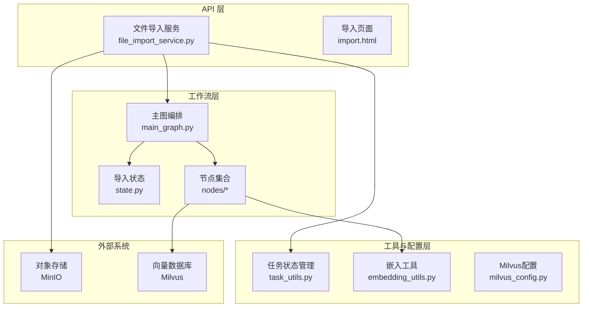
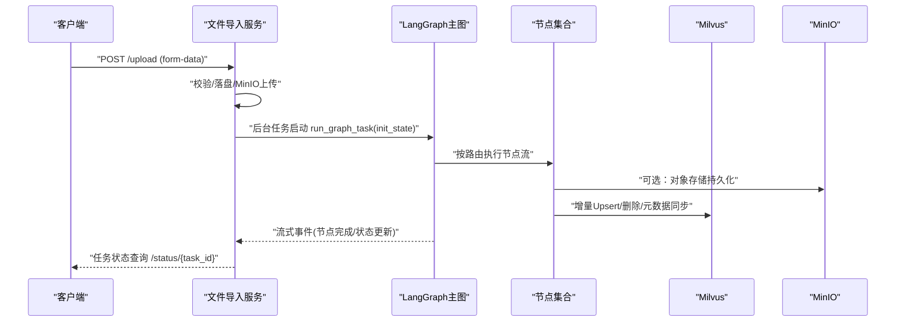
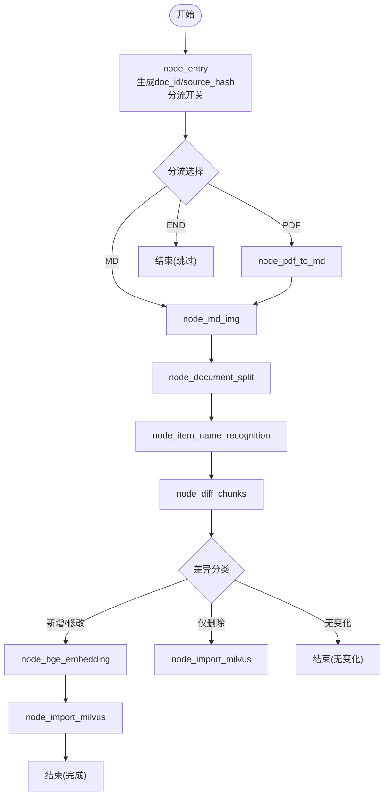
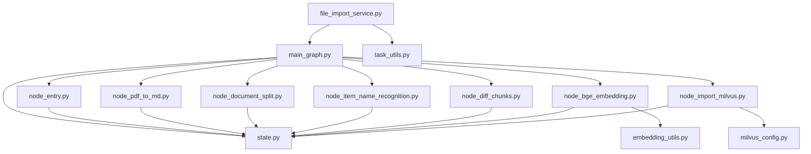

# 导入处理系统

<cite>
**本文档引用的文件**
- [app/import_process/agent/main_graph.py](file://app/import_process/agent/main_graph.py)
- [app/import_process/agent/state.py](file://app/import_process/agent/state.py)
- [app/import_process/api/file_import_service.py](file://app/import_process/api/file_import_service.py)
- [app/import_process/agent/nodes/node_entry.py](file://app/import_process/agent/nodes/node_entry.py)
- [app/import_process/agent/nodes/node_pdf_to_md.py](file://app/import_process/agent/nodes/node_pdf_to_md.py)
- [app/import_process/agent/nodes/node_document_split.py](file://app/import_process/agent/nodes/node_document_split.py)
- [app/import_process/agent/nodes/node_item_name_recognition.py](file://app/import_process/agent/nodes/node_item_name_recognition.py)
- [app/import_process/agent/nodes/node_diff_chunks.py](file://app/import_process/agent/nodes/node_diff_chunks.py)
- [app/import_process/agent/nodes/node_bge_embedding.py](file://app/import_process/agent/nodes/node_bge_embedding.py)
- [app/import_process/agent/nodes/node_import_milvus.py](file://app/import_process/agent/nodes/node_import_milvus.py)
- [app/import_process/agent/import_summary.py](file://app/import_process/agent/import_summary.py)
- [app/config/milvus_config.py](file://app/config/milvus_config.py)
- [app/lm/embedding_utils.py](file://app/lm/embedding_utils.py)
- [app/utils/task_utils.py](file://app/utils/task_utils.py)
- [static_flowcharts/import_main_flow.mmd](file://static_flowcharts/import_main_flow.mmd)
</cite>

## 目录
1. [简介](#简介)
2. [项目结构](#项目结构)
3. [核心组件](#核心组件)
4. [架构总览](#架构总览)
5. [详细组件分析](#详细组件分析)
6. [依赖关系分析](#依赖关系分析)
7. [性能考量](#性能考量)
8. [故障排除指南](#故障排除指南)
9. [结论](#结论)
10. [附录](#附录)

## 简介
本系统提供从文件上传到向量存储的完整导入处理链路，基于 LangGraph 工作流编排，支持 PDF/MD 文档解析、智能切分、主体识别、增量差异检测、混合向量化与 Milvus 增量入库。系统通过状态机驱动的节点化流程，结合任务状态管理与结构化导入摘要，实现高效、可观测、可扩展的知识库导入。

## 项目结构
导入处理系统主要由三层构成：
- API 层：提供文件上传、任务状态查询等 HTTP 接口，桥接 Web 请求与 LangGraph 执行。
- 工作流层：以 LangGraph StateGraph 定义节点与流转，串联解析、切分、识别、差异、向量化与入库。
- 工具与配置层：提供 Milvus、MinIO、嵌入模型等外部集成与配置。

图表来源
- [app/import_process/api/file_import_service.py:1-432](file://app/import_process/api/file_import_service.py#L1-L432)
- [app/import_process/agent/main_graph.py:1-88](file://app/import_process/agent/main_graph.py#L1-L88)
- [app/import_process/agent/state.py:1-115](file://app/import_process/agent/state.py#L1-L115)
- [app/utils/task_utils.py:1-218](file://app/utils/task_utils.py#L1-L218)
- [app/lm/embedding_utils.py:1-117](file://app/lm/embedding_utils.py#L1-L117)
- [app/config/milvus_config.py:1-33](file://app/config/milvus_config.py#L1-L33)

章节来源
- [app/import_process/api/file_import_service.py:1-432](file://app/import_process/api/file_import_service.py#L1-L432)
- [app/import_process/agent/main_graph.py:1-88](file://app/import_process/agent/main_graph.py#L1-L88)
- [app/import_process/agent/state.py:1-115](file://app/import_process/agent/state.py#L1-L115)

## 核心组件
- LangGraph 主图与节点：定义导入流程的节点、边与条件路由，实现从入口分流到增量入库的全链路编排。
- 导入状态：TypedDict 定义的统一状态结构，承载任务元数据、路径、内容、增量摘要与中间产物。
- API 服务：FastAPI 接口负责文件上传、MinIO 持久化、后台任务调度与任务状态查询。
- 任务状态管理：内存态的任务运行/完成队列与状态机，支撑前端轮询与 SSE 推送。
- 嵌入与向量：BGE-M3 混合向量生成，支持稠密/稀疏向量与批量分批处理。
- Milvus 集成：自动建表、索引、增量 Upsert、元数据集合同步与 chunk_id 反查。

章节来源
- [app/import_process/agent/main_graph.py:1-88](file://app/import_process/agent/main_graph.py#L1-L88)
- [app/import_process/agent/state.py:1-115](file://app/import_process/agent/state.py#L1-L115)
- [app/import_process/api/file_import_service.py:1-432](file://app/import_process/api/file_import_service.py#L1-L432)
- [app/utils/task_utils.py:1-218](file://app/utils/task_utils.py#L1-L218)
- [app/lm/embedding_utils.py:1-117](file://app/lm/embedding_utils.py#L1-L117)
- [app/import_process/agent/nodes/node_import_milvus.py:1-329](file://app/import_process/agent/nodes/node_import_milvus.py#L1-L329)

## 架构总览
系统采用“API -> LangGraph 工作流 -> 节点 -> 外部系统”的分层架构。API 层负责安全落盘与 MinIO 持久化，LangGraph 层编排节点执行并实时更新任务状态，节点层完成 PDF/MD 解析、切分、主体识别、差异检测、向量化与 Milvus 增量入库，外部系统包括 MinIO 与 Milvus。

图表来源
- [app/import_process/api/file_import_service.py:151-254](file://app/import_process/api/file_import_service.py#L151-L254)
- [app/import_process/agent/main_graph.py:34-85](file://app/import_process/agent/main_graph.py#L34-L85)

章节来源
- [app/import_process/api/file_import_service.py:151-254](file://app/import_process/api/file_import_service.py#L151-L254)
- [app/import_process/agent/main_graph.py:34-85](file://app/import_process/agent/main_graph.py#L34-L85)

## 详细组件分析

### LangGraph 主图与状态
- 主图定义：节点包括入口、PDF 转 Markdown、Markdown 图片处理、文档切分、主体识别、差异检测、向量化、Milvus 入库。
- 条件路由：
  - 入口后根据 is_md_read_enabled/is_pdf_read_enabled 决定分流。
  - 差异后根据是否有新增/修改、仅删除或无变化决定走向向量化或直接入库。
- 状态结构：包含任务元数据、路径、内容、增量摘要、diff 结果与向量内容等字段，提供默认状态工厂与深拷贝保障。

图表来源
- [app/import_process/agent/main_graph.py:34-85](file://app/import_process/agent/main_graph.py#L34-L85)
- [app/import_process/agent/state.py:7-115](file://app/import_process/agent/state.py#L7-L115)

章节来源
- [app/import_process/agent/main_graph.py:1-88](file://app/import_process/agent/main_graph.py#L1-L88)
- [app/import_process/agent/state.py:1-115](file://app/import_process/agent/state.py#L1-L115)

### 节点：入口与分流
- 校验文件存在性与后缀，生成 doc_id（优先使用外部 ID，否则基于绝对路径哈希），计算 source_hash 并与历史快照对比，决定是否整链路跳过。
- 设置 is_md_read_enabled/is_pdf_read_enabled 与 md_content/md_hash（MD 输入时）。

章节来源
- [app/import_process/agent/nodes/node_entry.py:17-75](file://app/import_process/agent/nodes/node_entry.py#L17-L75)

### 节点：PDF 转 Markdown
- 校验路径与输出目录，上传 PDF 至 MinerU，轮询解析结果，下载 ZIP 并解压，按优先级匹配目标 MD 文件并重命名为与 PDF 同名。
- 异常分级处理，失败抛出终止工作流。

章节来源
- [app/import_process/agent/nodes/node_pdf_to_md.py:62-116](file://app/import_process/agent/nodes/node_pdf_to_md.py#L62-L116)
- [app/import_process/agent/nodes/node_pdf_to_md.py:153-285](file://app/import_process/agent/nodes/node_pdf_to_md.py#L153-L285)
- [app/import_process/agent/nodes/node_pdf_to_md.py:288-378](file://app/import_process/agent/nodes/node_pdf_to_md.py#L288-L378)

### 节点：文档切分（智能切分）
- 按标题构建章节路径，再按段落、列表、表格、代码块做语义切分，超长块二次切分，极短块保守合并。
- 补齐增量同步所需元数据：doc_id/doc_version、section_path、chunk_hash、chunk_key。
- 备份 chunks.json 便于排查。

章节来源
- [app/import_process/agent/nodes/node_document_split.py:38-75](file://app/import_process/agent/nodes/node_document_split.py#L38-L75)
- [app/import_process/agent/nodes/node_document_split.py:582-646](file://app/import_process/agent/nodes/node_document_split.py#L582-L646)

### 节点：主体识别与标签
- 从文件标题与前 K 个切片中抽取锚点名称，结合大模型识别主体名称，做回退与一致性校验，清洗候选并生成最终 item_name。
- 为每个切片回填 item_name，并生成 BGE-M3 双向量（稠密/稀疏），存入 Milvus item_name 集合。

章节来源
- [app/import_process/agent/nodes/node_item_name_recognition.py:247-307](file://app/import_process/agent/nodes/node_item_name_recognition.py#L247-L307)
- [app/import_process/agent/nodes/node_item_name_recognition.py:543-680](file://app/import_process/agent/nodes/node_item_name_recognition.py#L543-L680)

### 节点：差异检测（增量同步）
- 基于 chunk_key 与 chunk_hash 对比，将当前切分结果分为 added/updated/deleted/unchanged。
- 若无任何变化，标记 skip_import 并生成相应导入摘要。

章节来源
- [app/import_process/agent/nodes/node_diff_chunks.py:11-52](file://app/import_process/agent/nodes/node_diff_chunks.py#L11-L52)
- [app/import_process/agent/nodes/node_diff_chunks.py:55-93](file://app/import_process/agent/nodes/node_diff_chunks.py#L55-L93)

### 节点：混合向量化（BGE-M3）
- 文本拼接：item_name + content，分批（默认 5）调用 BGE-M3 生成稠密/稀疏双向量，异常批次保留原数据。
- 输出：每个切片新增 dense_vector/sparse_vector 字段。

章节来源
- [app/import_process/agent/nodes/node_bge_embedding.py:35-77](file://app/import_process/agent/nodes/node_bge_embedding.py#L35-L77)
- [app/import_process/agent/nodes/node_bge_embedding.py:128-201](file://app/import_process/agent/nodes/node_bge_embedding.py#L128-L201)

### 节点：Milvus 增量入库
- 自动建表与索引，兼容旧 schema；分离主集合与正式元数据集合，确保增量同步的稳定性。
- 删除：按历史 chunk_id 或通过元数据集合反查 chunk_id 后删除。
- Upsert：对更新的 chunk 先删后插，回填新 chunk_id；对新增/变更的 chunk 写入主集合与元数据集合。
- 注册快照：入库完成后写入文档快照，包含 doc_id/doc_version/file_title/item_name/source_path/source_hash/md_hash。

章节来源
- [app/import_process/agent/nodes/node_import_milvus.py:20-67](file://app/import_process/agent/nodes/node_import_milvus.py#L20-L67)
- [app/import_process/agent/nodes/node_import_milvus.py:70-134](file://app/import_process/agent/nodes/node_import_milvus.py#L70-L134)
- [app/import_process/agent/nodes/node_import_milvus.py:136-180](file://app/import_process/agent/nodes/node_import_milvus.py#L136-L180)
- [app/import_process/agent/nodes/node_import_milvus.py:183-329](file://app/import_process/agent/nodes/node_import_milvus.py#L183-L329)

### API：文件导入服务
- 接口：/upload（多文件）、/status/{task_id}、/import.html。
- 安全落盘：清理与校验上传文件名，限制写入边界；MinIO 上传失败仅记录警告，不影响本地处理。
- 后台任务：run_graph_task 使用 stream 模式实时推送节点完成事件，更新任务状态与导入摘要。
- 任务状态：内存态维护 running/done 列表与状态，支持中文节点名映射与 SSE 推送。

章节来源
- [app/import_process/api/file_import_service.py:261-380](file://app/import_process/api/file_import_service.py#L261-L380)
- [app/import_process/api/file_import_service.py:386-412](file://app/import_process/api/file_import_service.py#L386-L412)
- [app/utils/task_utils.py:69-110](file://app/utils/task_utils.py#L69-L110)
- [app/utils/task_utils.py:180-202](file://app/utils/task_utils.py#L180-L202)

### 导入摘要与状态
- 导入摘要：统一 action（跳过/删除/增量 Upsert/noop）、计数与成本视角指标，便于上层与前端展示。
- 状态默认值：提供深拷贝默认状态工厂，避免多任务共享同一份对象。

章节来源
- [app/import_process/agent/import_summary.py:6-61](file://app/import_process/agent/import_summary.py#L6-L61)
- [app/import_process/agent/state.py:100-109](file://app/import_process/agent/state.py#L100-L109)

## 依赖关系分析
- LangGraph 依赖：各节点依赖 ImportGraphState 与任务工具，节点间通过状态字段传递数据。
- 外部依赖：MinerU（PDF 解析）、MinIO（对象存储）、Milvus（向量存储）、BGE-M3（嵌入模型）。
- 配置依赖：Milvus 配置类读取环境变量，嵌入工具读取嵌入配置。

图表来源
- [app/import_process/agent/main_graph.py:1-88](file://app/import_process/agent/main_graph.py#L1-L88)
- [app/import_process/agent/state.py:1-115](file://app/import_process/agent/state.py#L1-L115)
- [app/lm/embedding_utils.py:1-117](file://app/lm/embedding_utils.py#L1-L117)
- [app/config/milvus_config.py:1-33](file://app/config/milvus_config.py#L1-L33)
- [app/import_process/api/file_import_service.py:1-432](file://app/import_process/api/file_import_service.py#L1-L432)
- [app/utils/task_utils.py:1-218](file://app/utils/task_utils.py#L1-L218)

章节来源
- [app/import_process/agent/main_graph.py:1-88](file://app/import_process/agent/main_graph.py#L1-L88)
- [app/import_process/agent/state.py:1-115](file://app/import_process/agent/state.py#L1-L115)
- [app/lm/embedding_utils.py:1-117](file://app/lm/embedding_utils.py#L1-L117)
- [app/config/milvus_config.py:1-33](file://app/config/milvus_config.py#L1-L33)
- [app/import_process/api/file_import_service.py:1-432](file://app/import_process/api/file_import_service.py#L1-L432)
- [app/utils/task_utils.py:1-218](file://app/utils/task_utils.py#L1-L218)

## 性能考量
- 向量化批处理：默认批大小 5，避免显存溢出；可根据 GPU 显存调整。
- 嵌入模型单例：避免重复加载，降低初始化开销。
- Milvus 索引：稠密向量使用 HNSW+COSINE，稀疏向量使用 SPARSE_INVERTED_INDEX+IP，兼顾速度与精度。
- 任务状态内存化：轮询与 SSE 推送，避免频繁 IO。
- PDF 解析重试与超时：MinerU 上传与轮询设置重试与超时，平衡可靠性与延迟。
- 增量同步：基于 chunk_key/hash 的差异检测，仅处理变更块，显著降低向量化与入库成本。

## 故障排除指南
- MinIO 连接失败：上传至 MinIO 失败仅记录警告，不影响本地处理流程，检查 MinIO 配置与桶名。
- MinerU 解析失败：检查 MINERU_BASE_URL、MINERU_API_TOKEN 与网络代理配置；关注轮询超时与业务错误。
- Milvus 连接失败：检查 MILVUS_URL 与集合配置；首次导入自动建表，若失败检查权限与网络。
- 向量化异常：单批次异常保留原数据继续处理，检查模型路径、设备与显存；适当减小批大小。
- 任务状态异常：确认任务状态内存结构初始化与中文映射；检查 SSE 推送队列。
- 导入摘要异常：确认节点是否正确回填 import_summary；检查 skip_import/skip_reason 的设置逻辑。

章节来源
- [app/import_process/api/file_import_service.py:339-360](file://app/import_process/api/file_import_service.py#L339-L360)
- [app/import_process/agent/nodes/node_pdf_to_md.py:162-192](file://app/import_process/agent/nodes/node_pdf_to_md.py#L162-L192)
- [app/import_process/agent/nodes/node_import_milvus.py:72-85](file://app/import_process/agent/nodes/node_import_milvus.py#L72-L85)
- [app/import_process/agent/nodes/node_bge_embedding.py:191-199](file://app/import_process/agent/nodes/node_bge_embedding.py#L191-L199)
- [app/utils/task_utils.py:180-202](file://app/utils/task_utils.py#L180-L202)

## 结论
本系统通过 LangGraph 将复杂的导入流程模块化、可观测化与增量化，结合 BGE-M3 混合向量与 Milvus 增量 Upsert，实现了从 PDF/MD 到向量库的高效闭环。API 层的安全落盘与任务状态管理保障了生产可用性，而结构化导入摘要与中文节点映射提升了可观测性与可运维性。

## 附录
- 流程图参考：静态流程图展示了从上传到持久化的端到端流程。

章节来源
- [static_flowcharts/import_main_flow.mmd:1-31](file://static_flowcharts/import_main_flow.mmd#L1-L31)