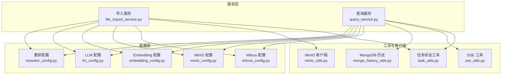
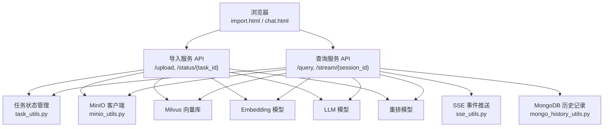
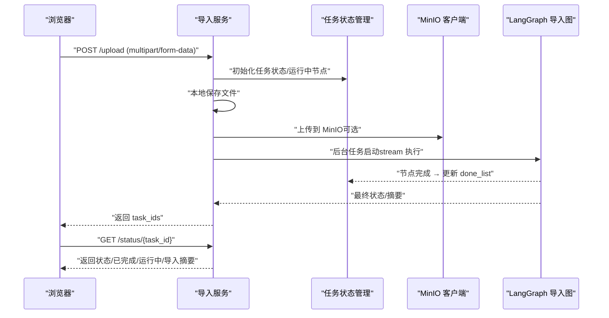
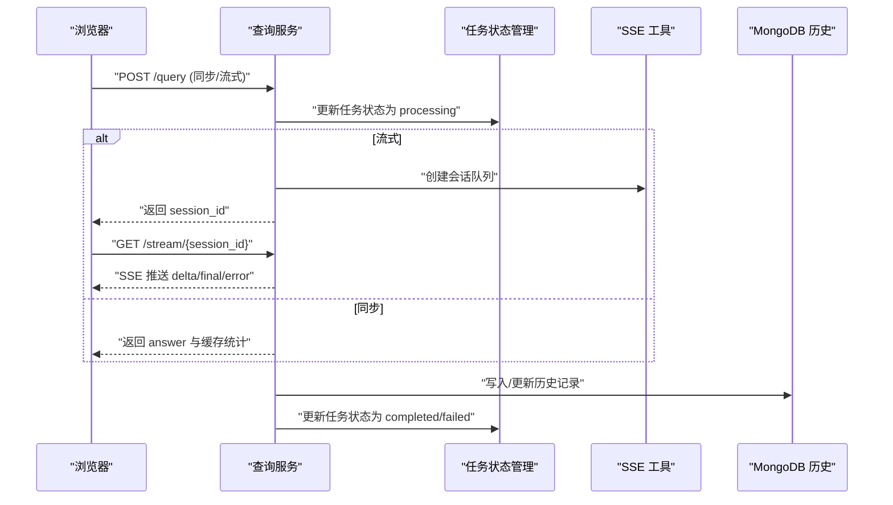

# 快速开始

<cite>
**本文引用的文件**
- [pyproject.toml](file://pyproject.toml)
- [file_import_service.py](file://app/import_process/api/file_import_service.py)
- [query_service.py](file://app/query_process/api/query_service.py)
- [milvus_config.py](file://app/config/milvus_config.py)
- [minio_config.py](file://app/config/minio_config.py)
- [embedding_config.py](file://app/config/embedding_config.py)
- [lm_config.py](file://app/config/lm_config.py)
- [reranker_config.py](file://app/config/reranker_config.py)
- [minio_utils.py](file://app/clients/minio_utils.py)
- [mongo_history_utils.py](file://app/clients/mongo_history_utils.py)
- [task_utils.py](file://app/utils/task_utils.py)
- [sse_utils.py](file://app/utils/sse_utils.py)
- [import.html](file://app/import_process/page/import.html)
- [chat.html](file://app/query_process/page/chat.html)
</cite>

## 目录
1. [简介](#简介)
2. [项目结构](#项目结构)
3. [核心组件](#核心组件)
4. [架构总览](#架构总览)
5. [详细组件分析](#详细组件分析)
6. [依赖分析](#依赖分析)
7. [性能考虑](#性能考虑)
8. [故障排查指南](#故障排查指南)
9. [结论](#结论)
10. [附录](#附录)

## 简介
本指南面向首次接触 zhiku 系统的新用户，帮助你在约 30 分钟内完成环境准备、依赖安装、数据库与对象存储配置，并成功导入第一个文档，随后启动查询服务进行问答体验。你将学到：
- Python 环境要求与依赖安装
- 系统依赖（如 Milvus、MinIO、MongoDB）的最小化配置
- 环境变量与配置文件的组织方式
- 启动导入服务与查询服务的方法
- 通过浏览器页面完成文档上传与进度跟踪
- 基本的 API 调用示例（同步与流式）
- 常见初始化问题的定位与修复思路

## 项目结构
zhiku 采用“服务分层 + 配置集中 + 工具模块化”的组织方式：
- 顶层通过 pyproject.toml 管理项目元信息与依赖
- 服务层分为“导入服务”和“查询服务”，分别提供文件上传、进度查询与问答、SSE 流式输出、历史记录管理
- 配置层通过 dataclass 读取 .env 环境变量，集中管理 Milvus、MinIO、Embedding、LLM、Reranker 等
- 工具层提供任务状态管理、SSE 事件推送、MongoDB 历史记录等通用能力

图表来源
- [file_import_service.py:1-432](file://app/import_process/api/file_import_service.py#L1-L432)
- [query_service.py:1-317](file://app/query_process/api/query_service.py#L1-L317)
- [milvus_config.py:1-33](file://app/config/milvus_config.py#L1-L33)
- [minio_config.py:1-35](file://app/config/minio_config.py#L1-L35)
- [embedding_config.py:1-31](file://app/config/embedding_config.py#L1-L31)
- [lm_config.py:1-33](file://app/config/lm_config.py#L1-L33)
- [reranker_config.py:1-28](file://app/config/reranker_config.py#L1-L28)
- [task_utils.py:1-218](file://app/utils/task_utils.py#L1-L218)
- [sse_utils.py:1-113](file://app/utils/sse_utils.py#L1-L113)
- [minio_utils.py:1-45](file://app/clients/minio_utils.py#L1-L45)
- [mongo_history_utils.py:1-253](file://app/clients/mongo_history_utils.py#L1-L253)

章节来源
- [pyproject.toml:1-33](file://pyproject.toml#L1-L33)
- [file_import_service.py:1-432](file://app/import_process/api/file_import_service.py#L1-L432)
- [query_service.py:1-317](file://app/query_process/api/query_service.py#L1-L317)

## 核心组件
- 导入服务（文件上传与进度查询）
  - 提供 /upload（多文件）、/status/{task_id}（进度查询）、/import.html（前端页面）
  - 通过后台任务异步执行 LangGraph 导入流程，支持 MinIO 对象存储与本地落盘
- 查询服务（问答与历史）
  - 提供 /query（同步/流式）、/stream/{session_id}（SSE）、/history/{session_id}、/clear/{session_id}
  - 内置 chat.html 页面，便于本地调试
- 配置系统
  - 通过 dataclass 读取 .env，集中管理 Milvus、MinIO、Embedding、LLM、Reranker
- 工具与客户端
  - 任务状态内存态管理、SSE 事件队列、MinIO 客户端初始化与桶策略、MongoDB 历史记录读写

章节来源
- [file_import_service.py:256-413](file://app/import_process/api/file_import_service.py#L256-L413)
- [query_service.py:214-307](file://app/query_process/api/query_service.py#L214-L307)
- [milvus_config.py:12-26](file://app/config/milvus_config.py#L12-L26)
- [minio_config.py:17-34](file://app/config/minio_config.py#L17-L34)
- [embedding_config.py:9-24](file://app/config/embedding_config.py#L9-L24)
- [lm_config.py:11-26](file://app/config/lm_config.py#L11-L26)
- [reranker_config.py:9-21](file://app/config/reranker_config.py#L9-L21)
- [task_utils.py:54-203](file://app/utils/task_utils.py#L54-L203)
- [sse_utils.py:17-106](file://app/utils/sse_utils.py#L17-L106)
- [minio_utils.py:10-44](file://app/clients/minio_utils.py#L10-L44)
- [mongo_history_utils.py:21-84](file://app/clients/mongo_history_utils.py#L21-L84)

## 架构总览
下图展示了从浏览器到服务、再到外部系统（Milvus、MinIO、MongoDB）的整体交互。

图表来源
- [file_import_service.py:256-413](file://app/import_process/api/file_import_service.py#L256-L413)
- [query_service.py:214-307](file://app/query_process/api/query_service.py#L214-L307)
- [task_utils.py:54-203](file://app/utils/task_utils.py#L54-L203)
- [sse_utils.py:17-106](file://app/utils/sse_utils.py#L17-L106)
- [minio_utils.py:10-44](file://app/clients/minio_utils.py#L10-L44)
- [mongo_history_utils.py:21-84](file://app/clients/mongo_history_utils.py#L21-L84)

## 详细组件分析

### 组件A：导入服务（文件上传与进度查询）
- 功能要点
  - 支持 PDF/MD 多文件上传，自动清洗与校验文件名，防止路径逃逸
  - 本地落盘 + 可选 MinIO 对象存储持久化
  - 后台任务异步执行 LangGraph 导入流程，实时更新任务状态与节点进度
  - 提供 /status/{task_id} 查询任务状态与导入摘要
- 关键流程（上传 → 后台执行 → 状态更新）

图表来源
- [file_import_service.py:261-380](file://app/import_process/api/file_import_service.py#L261-L380)
- [file_import_service.py:386-412](file://app/import_process/api/file_import_service.py#L386-L412)
- [task_utils.py:54-118](file://app/utils/task_utils.py#L54-L118)
- [minio_utils.py:43-44](file://app/clients/minio_utils.py#L43-L44)

章节来源
- [file_import_service.py:256-413](file://app/import_process/api/file_import_service.py#L256-L413)
- [task_utils.py:54-203](file://app/utils/task_utils.py#L54-L203)
- [import.html:159-200](file://app/import_process/page/import.html#L159-L200)

### 组件B：查询服务（问答与历史）
- 功能要点
  - /query 支持同步与流式两种模式；流式通过 SSE 推送增量与最终答案
  - /history/{session_id} 查询与 /history/{session_id} 清空历史
  - 内置 chat.html 页面，便于本地调试
- 关键流程（同步/流式 → SSE 推送 → 历史记录）

图表来源
- [query_service.py:214-307](file://app/query_process/api/query_service.py#L214-L307)
- [task_utils.py:180-203](file://app/utils/task_utils.py#L180-L203)
- [sse_utils.py:54-106](file://app/utils/sse_utils.py#L54-L106)
- [mongo_history_utils.py:87-224](file://app/clients/mongo_history_utils.py#L87-L224)

章节来源
- [query_service.py:214-307](file://app/query_process/api/query_service.py#L214-L307)
- [chat.html:159-200](file://app/query_process/page/chat.html#L159-L200)

### 组件C：配置系统（环境变量与 dataclass）
- 配置项概览
  - Milvus：连接地址、集合名称
  - MinIO：endpoint/access_key/secret_key/bucket/minio_secure/img_dir
  - Embedding：本地模型路径、仓库标识、设备、半精度开关
  - LLM：基础地址、API Key、默认模型、温度
  - Reranker：本地模型路径、设备、半精度开关
- 读取机制
  - 所有配置类在模块加载时调用 load_dotenv()，随后通过 os.getenv() 读取 .env 中的键值

章节来源
- [milvus_config.py:12-26](file://app/config/milvus_config.py#L12-L26)
- [minio_config.py:17-34](file://app/config/minio_config.py#L17-L34)
- [embedding_config.py:9-24](file://app/config/embedding_config.py#L9-L24)
- [lm_config.py:11-26](file://app/config/lm_config.py#L11-L26)
- [reranker_config.py:9-21](file://app/config/reranker_config.py#L9-L21)

### 组件D：工具与客户端
- 任务状态管理（task_utils.py）
  - 维护任务状态、运行中/已完成节点列表、任务结果（JSON/字符串）
  - 提供中文节点名映射，便于前端展示
- SSE 工具（sse_utils.py）
  - 为流式查询提供会话级事件队列，支持 ready/delta/final/error/close
- MinIO 客户端（minio_utils.py）
  - 按配置创建客户端，自动检测/创建桶并设置公开只读策略
- MongoDB 历史（mongo_history_utils.py）
  - 单例连接、集合初始化与索引、写入/更新/查询/清空历史

章节来源
- [task_utils.py:54-203](file://app/utils/task_utils.py#L54-L203)
- [sse_utils.py:17-106](file://app/utils/sse_utils.py#L17-L106)
- [minio_utils.py:10-44](file://app/clients/minio_utils.py#L10-L44)
- [mongo_history_utils.py:21-84](file://app/clients/mongo_history_utils.py#L21-L84)

## 依赖分析
- 语言与框架
  - Python >= 3.11
  - FastAPI + Uvicorn（服务端）
- 核心库
  - 向量与检索：pymilvus、flagembedding、ragas
  - LLM 与链：langchain、langchain-community、langchain-openai、langsmith
  - 文档解析：magic-pdf
  - 对象存储：minio
  - 数据库：pymongo
  - 工具：numpy、pandas、python-multipart、uvicorn[standard]、loguru、python-dotenv
- 依赖来源
  - 通过 pyproject.toml 的 dependencies 字段集中声明

章节来源
- [pyproject.toml:6-32](file://pyproject.toml#L6-L32)

## 性能考虑
- 上传与解析
  - 本地落盘 + MinIO 可选持久化，建议在磁盘充足时启用 MinIO 以降低本地压力
- LangGraph 执行
  - 后台任务异步执行，避免阻塞 API 响应；节点进度实时更新，前端可轮询 /status
- 查询流式
  - SSE 基于队列推送增量，减少等待；注意客户端断开时及时清理队列
- 数据库与索引
  - MongoDB 集合建立复合索引，按会话+时间排序，查询效率高

[本节为通用指导，不直接分析具体文件]

## 故障排查指南
- 环境变量缺失
  - 症状：导入/查询服务启动时报错或连接失败
  - 处理：确保 .env 中包含必要键（如 MILVUS_URL、MINIO_*、MONGO_*、OPENAI_*、BGE_* 等），并确认 load_dotenv() 能读取到
- MinIO 初始化失败
  - 症状：日志出现 MinIO 客户端初始化失败
  - 处理：检查 endpoint、access_key、secret_key、bucket_name；确认 MinIO 服务可达；必要时手动创建桶并设置策略
- MongoDB 连接失败
  - 症状：历史记录无法写入或查询报错
  - 处理：检查 MONGO_URL 与 MONGO_DB_NAME；确认 MongoDB 服务可用且网络可达
- 上传文件名异常
  - 症状：提示无效文件名或路径逃逸
  - 处理：确保上传文件名合法，避免包含路径分隔符或相对路径
- 任务状态异常
  - 症状：/status/{task_id} 返回空状态或节点未更新
  - 处理：确认 LangGraph 执行是否抛出异常；查看服务日志；检查任务状态更新逻辑

章节来源
- [minio_utils.py:38-40](file://app/clients/minio_utils.py#L38-L40)
- [mongo_history_utils.py:52-56](file://app/clients/mongo_history_utils.py#L52-L56)
- [file_import_service.py:98-111](file://app/import_process/api/file_import_service.py#L98-L111)
- [task_utils.py:180-191](file://app/utils/task_utils.py#L180-L191)

## 结论
通过本指南，你可以在 30 分钟内完成 zhiku 的基础部署与体验：安装依赖、配置环境变量、启动导入与查询服务、上传第一个文档并进行问答。建议在完成基础体验后，逐步完善模型下载、GPU/CPU 设备选择与性能调优，以及生产环境的安全加固（如 CORS 限制、鉴权与证书）。

[本节为总结性内容，不直接分析具体文件]

## 附录

### 环境搭建与依赖安装
- Python 环境
  - 要求：Python >= 3.11
  - 建议：使用虚拟环境隔离依赖
- 安装依赖
  - 使用包管理器安装项目依赖，详见 [pyproject.toml:6-32](file://pyproject.toml#L6-L32)
- 系统依赖（最小化）
  - Milvus：向量数据库，按官方文档安装并启动
  - MinIO：对象存储，按官方文档安装并启动
  - MongoDB：会话历史存储，按官方文档安装并启动

章节来源
- [pyproject.toml:6-32](file://pyproject.toml#L6-L32)

### 数据库连接设置
- Milvus
  - 在 .env 中设置 MILVUS_URL 与集合名称（chunks_collection、entity_name_collection、item_name_collection）
  - 参考：[milvus_config.py:12-26](file://app/config/milvus_config.py#L12-L26)
- MinIO
  - 在 .env 中设置 MINIO_ENDPOINT、MINIO_ACCESS_KEY、MINIO_SECRET_KEY、MINIO_BUCKET_NAME、MINIO_SECURE、MINIO_IMG_DIR
  - 客户端会在启动时自动创建桶并设置公开只读策略
  - 参考：[minio_config.py:17-34](file://app/config/minio_config.py#L17-L34)，[minio_utils.py:10-44](file://app/clients/minio_utils.py#L10-L44)
- MongoDB
  - 在 .env 中设置 MONGO_URL、MONGO_DB_NAME
  - 客户端会在模块加载时尝试初始化并创建索引
  - 参考：[mongo_history_utils.py:32-56](file://app/clients/mongo_history_utils.py#L32-L56)

### 第一个文档导入流程
- 启动导入服务
  - 运行导入服务脚本，监听本地端口（默认 8001）
  - 参考：[file_import_service.py:417-425](file://app/import_process/api/file_import_service.py#L417-L425)
- 上传文件
  - 通过浏览器访问 /import.html 或直接调用 /upload（multipart/form-data）
  - 支持 PDF/MD，多文件可同时上传
  - 参考：[file_import_service.py:261-380](file://app/import_process/api/file_import_service.py#L261-L380)，[import.html:159-200](file://app/import_process/page/import.html#L159-L200)
- 查看进度
  - 使用 /status/{task_id} 轮询任务状态与节点进度
  - 参考：[file_import_service.py:386-412](file://app/import_process/api/file_import_service.py#L386-L412)，[task_utils.py:146-177](file://app/utils/task_utils.py#L146-L177)

### 启动查询服务并进行问答
- 启动查询服务
  - 运行查询服务脚本，监听本地端口（默认 8002）
  - 参考：[query_service.py:309-310](file://app/query_process/api/query_service.py#L309-L310)
- 同步查询
  - POST /query，返回 answer 与缓存统计
  - 参考：[query_service.py:249-259](file://app/query_process/api/query_service.py#L249-L259)
- 流式查询
  - POST /query（is_stream=true），随后 GET /stream/{session_id} 实时接收增量
  - 参考：[query_service.py:229-248](file://app/query_process/api/query_service.py#L229-L248)，[query_service.py:263-277](file://app/query_process/api/query_service.py#L263-L277)，[sse_utils.py:54-106](file://app/utils/sse_utils.py#L54-L106)
- 历史记录
  - GET /history/{session_id} 查询最近 N 条
  - DELETE /history/{session_id} 清空
  - 参考：[query_service.py:280-306](file://app/query_process/api/query_service.py#L280-L306)，[mongo_history_utils.py:193-223](file://app/clients/mongo_history_utils.py#L193-L223)

### 常见初始化问题与验证步骤
- 问题：MinIO 客户端初始化失败
  - 验证：检查 .env 中 MINIO_* 配置；确认 MinIO 服务可达；查看日志
  - 参考：[minio_utils.py:38-40](file://app/clients/minio_utils.py#L38-L40)
- 问题：MongoDB 连接失败
  - 验证：检查 .env 中 MONGO_URL/MONGO_DB_NAME；确认 MongoDB 服务可用
  - 参考：[mongo_history_utils.py:52-56](file://app/clients/mongo_history_utils.py#L52-L56)
- 问题：上传文件名非法
  - 验证：确保文件扩展名为 .pdf/.md；避免路径注入
  - 参考：[file_import_service.py:98-111](file://app/import_process/api/file_import_service.py#L98-L111)
- 问题：LangGraph 执行异常
  - 验证：查看服务日志；确认模型路径与设备配置正确；检查 Milvus/MinIO 连通性
  - 参考：[file_import_service.py:249-254](file://app/import_process/api/file_import_service.py#L249-L254)