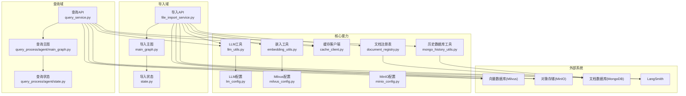
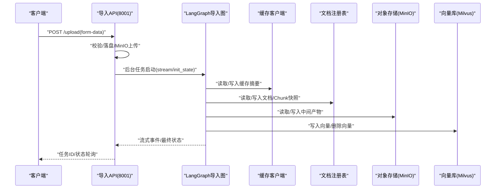
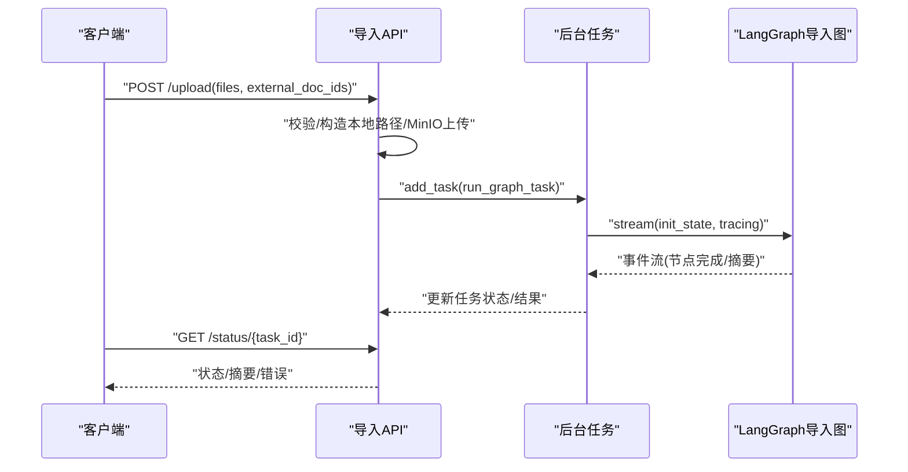
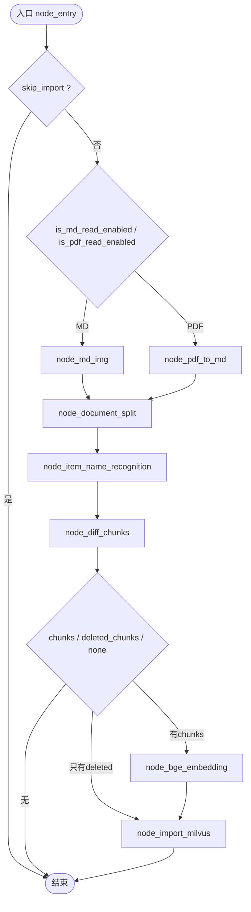
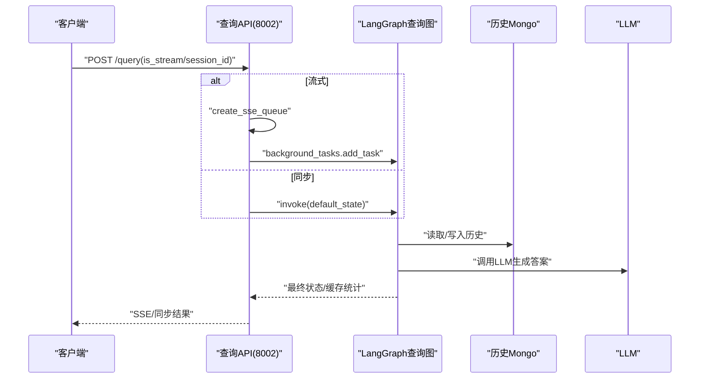
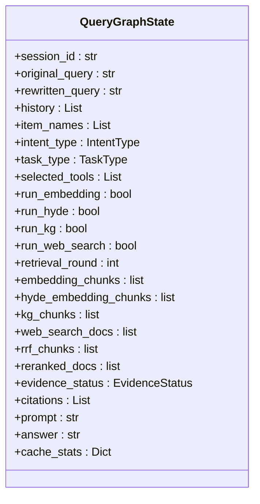
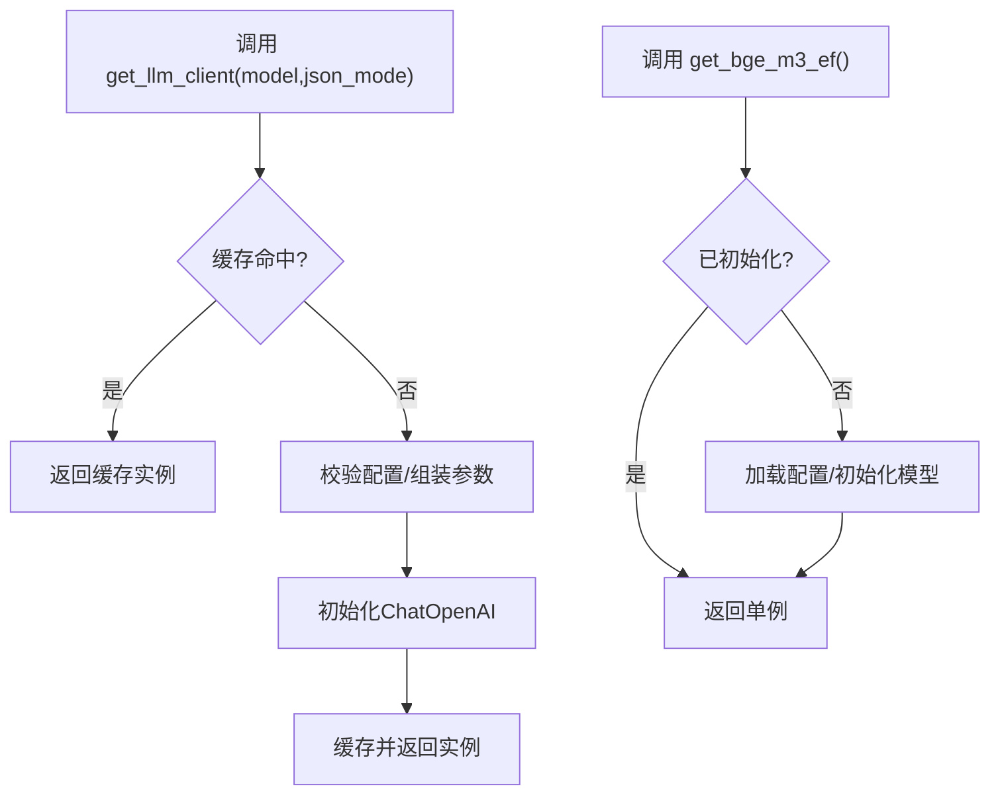
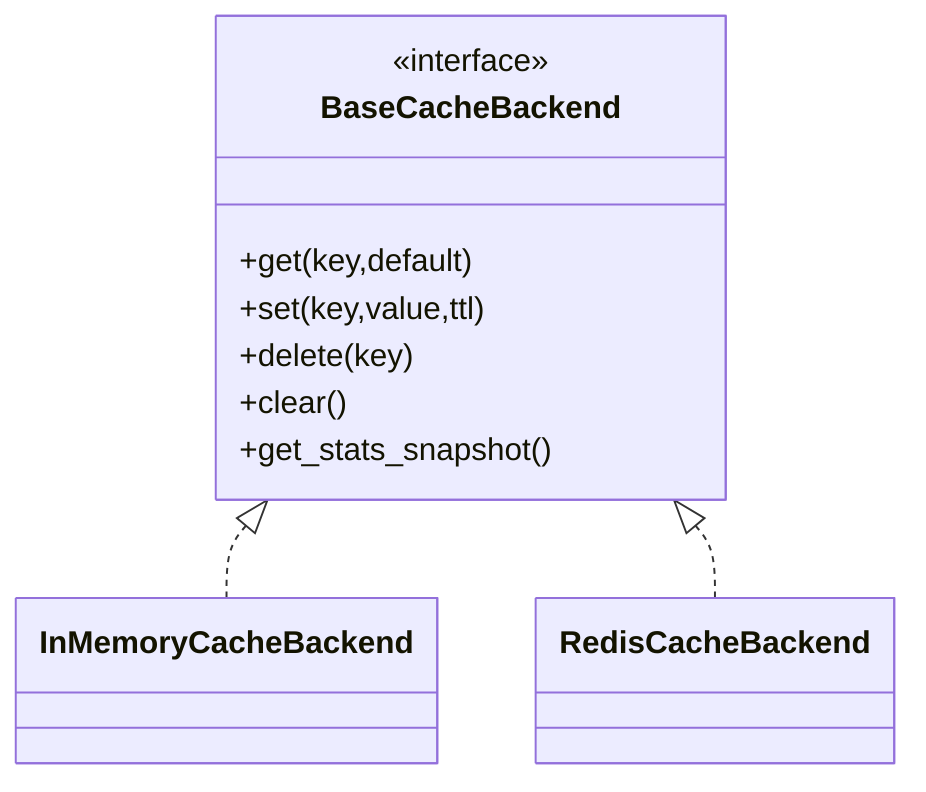
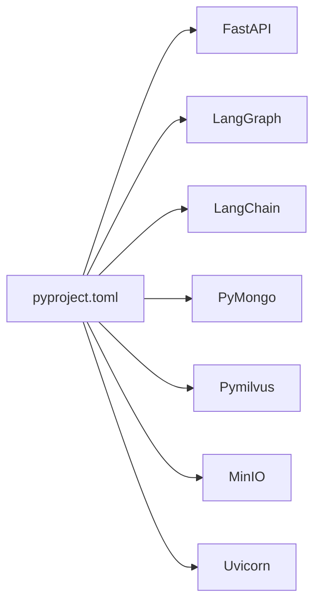

# 架构设计

<cite>
**本文引用的文件**
- [app/import_process/agent/main_graph.py](file://app/import_process/agent/main_graph.py)
- [app/import_process/agent/state.py](file://app/import_process/agent/state.py)
- [app/import_process/api/file_import_service.py](file://app/import_process/api/file_import_service.py)
- [app/query_process/agent/state.py](file://app/query_process/agent/state.py)
- [app/query_process/api/query_service.py](file://app/query_process/api/query_service.py)
- [app/lm/llm_utils.py](file://app/lm/llm_utils.py)
- [app/lm/embedding_utils.py](file://app/lm/embedding_utils.py)
- [app/clients/cache_client.py](file://app/clients/cache_client.py)
- [app/clients/document_registry.py](file://app/clients/document_registry.py)
- [app/clients/mongo_history_utils.py](file://app/clients/mongo_history_utils.py)
- [app/config/lm_config.py](file://app/config/lm_config.py)
- [app/config/milvus_config.py](file://app/config/milvus_config.py)
- [app/config/minio_config.py](file://app/config/minio_config.py)
- [pyproject.toml](file://pyproject.toml)
</cite>

## 目录
1. [简介](#简介)
2. [项目结构](#项目结构)
3. [核心组件](#核心组件)
4. [架构总览](#架构总览)
5. [详细组件分析](#详细组件分析)
6. [依赖分析](#依赖分析)
7. [性能考量](#性能考量)
8. [故障排查指南](#故障排查指南)
9. [结论](#结论)
10. [附录](#附录)

## 简介
本架构设计文档面向“zhiku”知识库系统，围绕LangGraph工作流引擎构建的导入与查询两大主流程，系统采用微服务化拆分（导入服务与查询服务分别监听不同端口）、可观测性（LangSmith集成）、可扩展的缓存与注册表、以及与向量库、对象存储、历史数据库的协作关系。本文将从系统边界、数据流、组件交互、状态管理、缓存与注册表、安全与监控、部署拓扑与基础设施等方面进行系统化阐述。

## 项目结构
系统采用按“功能域+分层”组织的目录结构：
- 导入域：导入API、LangGraph主图、节点、状态定义、页面
- 查询域：查询API、LangGraph主图、节点、状态定义、页面
- 核心能力：LLM与嵌入工具、缓存客户端、文档注册表、历史数据库工具、配置模块
- 资源与提示：prompts、静态流程图、测试与离线评估脚本

图表来源
- [app/import_process/api/file_import_service.py:113-127](file://app/import_process/api/file_import_service.py#L113-L127)
- [app/import_process/agent/main_graph.py:20-31](file://app/import_process/agent/main_graph.py#L20-L31)
- [app/query_process/api/query_service.py:51-59](file://app/query_process/api/query_service.py#L51-L59)
- [app/lm/llm_utils.py:17-73](file://app/lm/llm_utils.py#L17-L73)
- [app/lm/embedding_utils.py:8-49](file://app/lm/embedding_utils.py#L8-L49)
- [app/clients/cache_client.py:209-226](file://app/clients/cache_client.py#L209-L226)
- [app/clients/document_registry.py:191-205](file://app/clients/document_registry.py#L191-L205)
- [app/clients/mongo_history_utils.py:71-83](file://app/clients/mongo_history_utils.py#L71-L83)
- [app/config/lm_config.py:20-26](file://app/config/lm_config.py#L20-L26)
- [app/config/milvus_config.py:21-26](file://app/config/milvus_config.py#L21-L26)
- [app/config/minio_config.py:27-34](file://app/config/minio_config.py#L27-L34)

章节来源
- [pyproject.toml:1-33](file://pyproject.toml#L1-L33)

## 核心组件
- LangGraph工作流引擎：导入与查询两条主流程均以StateGraph定义，节点间通过共享状态字典传递数据，具备条件边与流式执行能力。
- API网关层：导入服务监听8001端口，查询服务监听8002端口，均基于FastAPI提供REST与SSE能力。
- LLM与嵌入：统一LLM客户端工厂与BGE-M3嵌入单例，支持缓存与配置注入。
- 缓存与注册表：统一缓存接口抽象，支持内存与Redis后端；文档注册表支持Mongo与JSON回退，保障增量同步一致性。
- 历史与可观测：Mongo历史记录与LangSmith中间件集成，提供SSE流式输出与链路追踪。
- 外部系统：Milvus向量库、MinIO对象存储、MongoDB文档库。

章节来源
- [app/import_process/agent/main_graph.py:20-87](file://app/import_process/agent/main_graph.py#L20-L87)
- [app/query_process/api/query_service.py:214-277](file://app/query_process/api/query_service.py#L214-L277)
- [app/lm/llm_utils.py:17-73](file://app/lm/llm_utils.py#L17-L73)
- [app/lm/embedding_utils.py:8-49](file://app/lm/embedding_utils.py#L8-L49)
- [app/clients/cache_client.py:209-226](file://app/clients/cache_client.py#L209-L226)
- [app/clients/document_registry.py:191-205](file://app/clients/document_registry.py#L191-L205)
- [app/clients/mongo_history_utils.py:71-83](file://app/clients/mongo_history_utils.py#L71-L83)

## 架构总览
系统采用“双服务+工作流引擎”的微服务架构：
- 导入服务：接收文件上传，落地MinIO，编排LangGraph导入图，产出增量快照与向量入库。
- 查询服务：接收查询请求，编排LangGraph查询图，结合缓存、历史与检索工具，输出答案与SSE流式结果。
- 状态管理：导入/查询均以TypedDict定义的状态对象贯穿全链路，节点按需读写字段。
- 可观测：LangSmith中间件与追踪上下文贯穿API与LangGraph执行。
- 可扩展：缓存与注册表后端可插拔，配置集中于环境变量与配置类。

图表来源
- [app/import_process/api/file_import_service.py:261-380](file://app/import_process/api/file_import_service.py#L261-L380)
- [app/import_process/agent/main_graph.py:100-115](file://app/import_process/agent/main_graph.py#L100-L115)
- [app/clients/cache_client.py:229-234](file://app/clients/cache_client.py#L229-L234)
- [app/clients/document_registry.py:208-214](file://app/clients/document_registry.py#L208-L214)

## 详细组件分析

### 导入服务（文件导入API）
- 职责：接收多文件上传、安全落盘、可选MinIO上传、后台LangGraph执行、任务状态查询。
- 关键流程：上传校验→本地落盘→MinIO上传→后台任务→LangGraph流式执行→状态更新。
- 安全：文件名清洗与路径边界校验，拒绝逃逸路径；CORS中间件配置。
- 可观测：LangSmith中间件与追踪元数据，SSE事件推送（导入侧以结构化摘要为主）。

图表来源
- [app/import_process/api/file_import_service.py:261-380](file://app/import_process/api/file_import_service.py#L261-L380)
- [app/import_process/api/file_import_service.py:161-254](file://app/import_process/api/file_import_service.py#L161-L254)

章节来源
- [app/import_process/api/file_import_service.py:55-156](file://app/import_process/api/file_import_service.py#L55-L156)
- [app/import_process/api/file_import_service.py:261-412](file://app/import_process/api/file_import_service.py#L261-L412)

### 导入主图与状态
- 主图：以StateGraph定义节点与条件边，支持入口分流与diff后路由，最终汇聚到Milvus入库。
- 状态：ImportGraphState包含任务元数据、路径字段、文档内容/切片、增量diff产物、导入摘要与嵌入产物等。
- 设计要点：入口短路跳过未变更文档；diff后仅对新增/修改chunk执行向量化与入库；删除仅触发入库删除分支。

图表来源
- [app/import_process/agent/main_graph.py:34-87](file://app/import_process/agent/main_graph.py#L34-L87)
- [app/import_process/agent/state.py:7-115](file://app/import_process/agent/state.py#L7-L115)

章节来源
- [app/import_process/agent/main_graph.py:20-87](file://app/import_process/agent/main_graph.py#L20-L87)
- [app/import_process/agent/state.py:63-115](file://app/import_process/agent/state.py#L63-L115)

### 查询服务（查询API）
- 职责：同步/流式查询、SSE实时推送、会话历史查询与清理、内嵌调试页面。
- 关键流程：参数装配→LangGraph执行→SSE事件推送/同步返回→历史写入→状态更新。
- 可扩展：Router开关控制多路检索（embedding/hyde/kg/web_search），支持多轮检索与反思。

图表来源
- [app/query_process/api/query_service.py:214-277](file://app/query_process/api/query_service.py#L214-L277)
- [app/query_process/api/query_service.py:151-211](file://app/query_process/api/query_service.py#L151-L211)

章节来源
- [app/query_process/api/query_service.py:1-317](file://app/query_process/api/query_service.py#L1-L317)

### 查询主图与状态
- 主图：以StateGraph定义“规划→检索→融合→反思→生成”全链路，节点按层读写状态。
- 状态：QueryGraphState以TypedDict定义，涵盖输入层、规划层、检索层、治理与输出层字段，支持渐进填充与多轮检索。

图表来源
- [app/query_process/agent/state.py:113-192](file://app/query_process/agent/state.py#L113-L192)

章节来源
- [app/query_process/agent/state.py:1-192](file://app/query_process/agent/state.py#L1-L192)

### LLM与嵌入工具
- LLM客户端：全局缓存、配置注入、异常包装、JSON模式输出；适配多模态与国产模型。
- 嵌入工具：BGE-M3单例、L2归一化、稀疏向量解析、格式适配、异常上抛。

图表来源
- [app/lm/llm_utils.py:17-73](file://app/lm/llm_utils.py#L17-L73)
- [app/lm/embedding_utils.py:8-49](file://app/lm/embedding_utils.py#L8-L49)

章节来源
- [app/lm/llm_utils.py:17-73](file://app/lm/llm_utils.py#L17-L73)
- [app/lm/embedding_utils.py:52-97](file://app/lm/embedding_utils.py#L52-L97)

### 缓存与文档注册表
- 缓存：统一接口抽象，内存与Redis后端可选，支持TTL、统计快照与回退策略。
- 注册表：文档/Chunk快照存储，Mongo优先，JSON回退，字段裁剪避免大对象与非字符串键。

图表来源
- [app/clients/cache_client.py:26-47](file://app/clients/cache_client.py#L26-L47)
- [app/clients/cache_client.py:49-121](file://app/clients/cache_client.py#L49-L121)
- [app/clients/cache_client.py:123-204](file://app/clients/cache_client.py#L123-L204)

章节来源
- [app/clients/cache_client.py:209-247](file://app/clients/cache_client.py#L209-L247)
- [app/clients/document_registry.py:191-219](file://app/clients/document_registry.py#L191-L219)

### 历史与可观测
- 历史：Mongo集合存储会话消息，索引优化查询；提供清理、更新、查询接口。
- 可观测：LangSmith中间件与追踪上下文，API与LangGraph执行均注入元数据。

章节来源
- [app/clients/mongo_history_utils.py:21-83](file://app/clients/mongo_history_utils.py#L21-L83)
- [app/query_process/api/query_service.py:35-41](file://app/query_process/api/query_service.py#L35-L41)
- [app/import_process/api/file_import_service.py:24-32](file://app/import_process/api/file_import_service.py#L24-L32)

## 依赖分析
- 语言与框架：Python 3.11+、FastAPI、Uvicorn、LangGraph、LangChain、Pymilvus、MinIO、PyMongo、Loguru、python-dotenv。
- 配置：LLM、Milvus、MinIO通过环境变量注入，集中于配置类。
- 外部依赖：Milvus向量库、MinIO对象存储、MongoDB文档库。

图表来源
- [pyproject.toml:6-32](file://pyproject.toml#L6-L32)

章节来源
- [pyproject.toml:1-33](file://pyproject.toml#L1-L33)
- [app/config/lm_config.py:20-26](file://app/config/lm_config.py#L20-L26)
- [app/config/milvus_config.py:21-26](file://app/config/milvus_config.py#L21-L26)
- [app/config/minio_config.py:27-34](file://app/config/minio_config.py#L27-L34)

## 性能考量
- 并发与异步：导入/查询均通过后台任务与流式执行，避免阻塞主线程。
- 缓存优化：LLM客户端与嵌入模型单例/缓存，减少初始化开销；查询链路分层缓存与统计。
- I/O与序列化：嵌入稀疏向量解析与JSON适配，避免不可序列化类型；注册表字段裁剪降低存储与传输成本。
- 检索与融合：RRF融合与重排，结合多路检索开关，平衡准确率与延迟。
- 可观测：LangSmith追踪与SSE事件，便于定位瓶颈与异常。

## 故障排查指南
- 配置缺失：LLM客户端初始化会校验API密钥与基础地址，缺失时抛出明确异常；MinIO/Redis/Mongo初始化失败时回退到内存/JSON。
- 上传安全：文件名清洗与路径边界校验，拒绝逃逸路径；MinIO上传失败不影响本地处理流程。
- LangGraph执行：导入/查询均在异常时更新任务状态为失败并记录错误；SSE错误事件推送。
- 历史与缓存：历史写入异常记录日志；缓存后端异常回退内存实现。

章节来源
- [app/lm/llm_utils.py:40-44](file://app/lm/llm_utils.py#L40-L44)
- [app/import_process/api/file_import_service.py:98-111](file://app/import_process/api/file_import_service.py#L98-L111)
- [app/import_process/api/file_import_service.py:339-360](file://app/import_process/api/file_import_service.py#L339-L360)
- [app/query_process/api/query_service.py:205-210](file://app/query_process/api/query_service.py#L205-L210)
- [app/clients/cache_client.py:223-225](file://app/clients/cache_client.py#L223-L225)

## 结论
zhiku系统以LangGraph为核心，构建了可扩展、可观测、可维护的知识库导入与查询体系。通过双服务分离、状态驱动的节点编排、统一缓存与注册表、以及与Milvus/MinIO/Mongo的协同，系统在准确性与性能之间取得良好平衡。未来可在容器化部署、弹性扩缩容、多实例共享注册表与缓存后端方面持续优化。

## 附录
- 端口与页面
  - 导入服务：8001，页面路径“/import.html”
  - 查询服务：8002，页面路径“/chat.html”
- 环境变量（示例）
  - OPENAI_API_BASE、OPENAI_API_KEY、LLM_DEFAULT_MODEL、LLM_DEFAULT_TEMPERATURE
  - MILVUS_URL、CHUNKS_COLLECTION、ITEM_NAME_COLLECTION
  - MINIO_ENDPOINT、MINIO_ACCESS_KEY、MINIO_SECRET_KEY、MINIO_BUCKET_NAME、MINIO_SECURE、MINIO_IMG_DIR
  - MONGO_URL、MONGO_DB_NAME、IMPORT_DOCUMENTS_COLLECTION、IMPORT_DOCUMENT_CHUNKS_COLLECTION
  - CACHE_BACKEND、CACHE_REDIS_URL