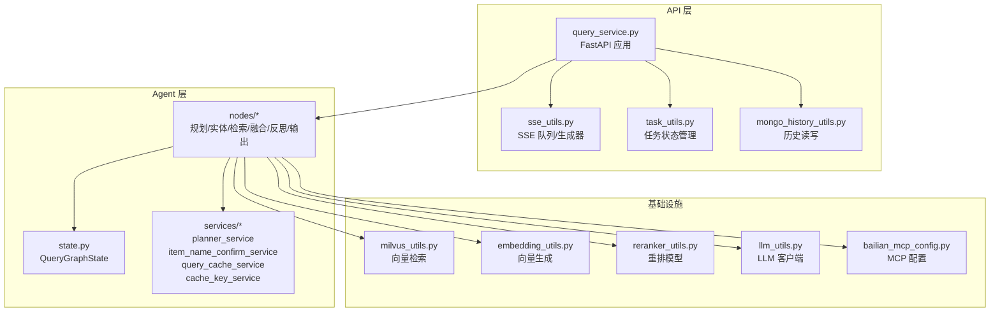
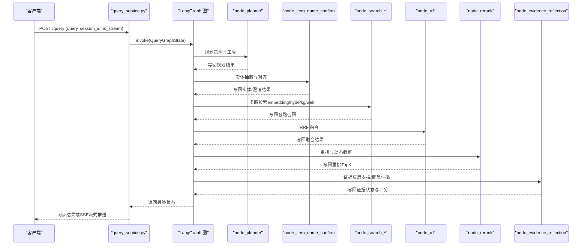
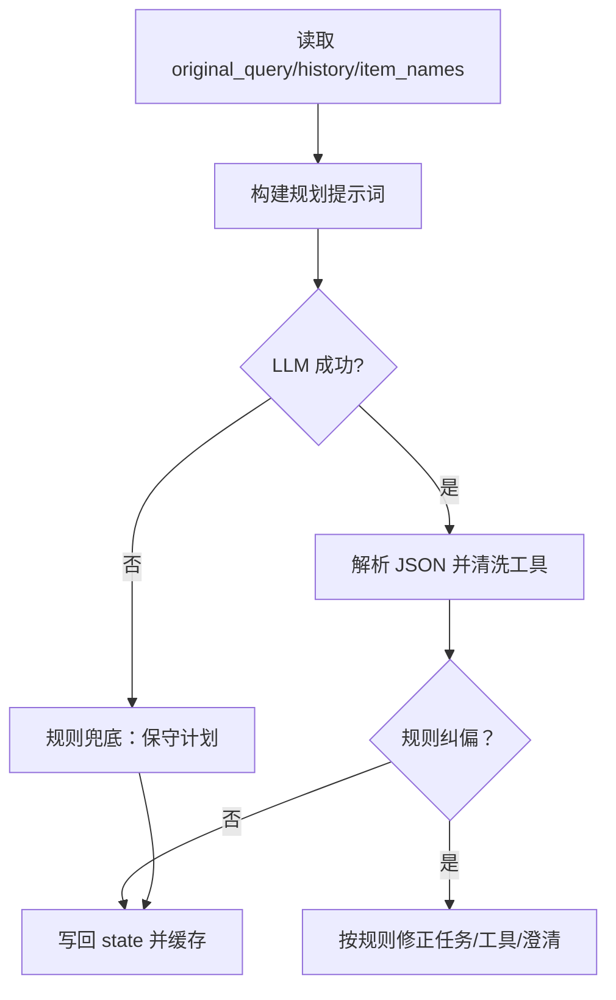
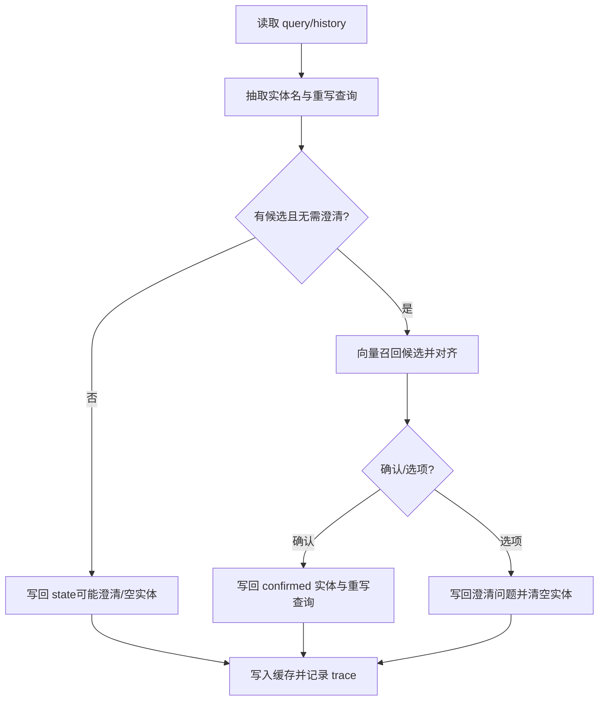
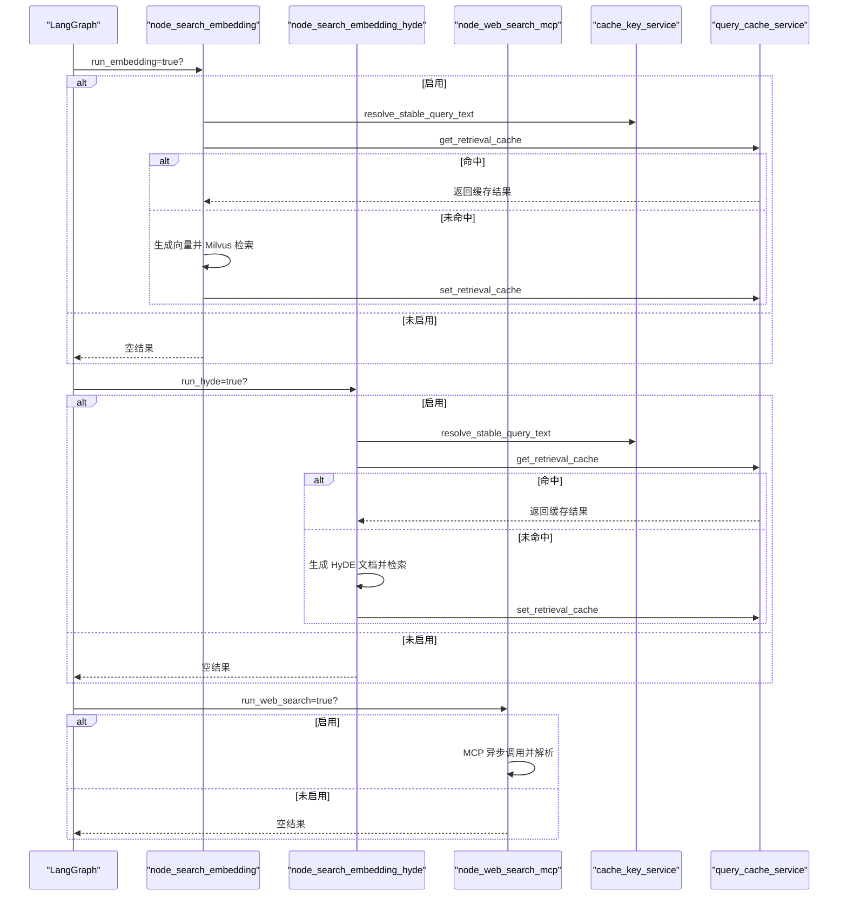
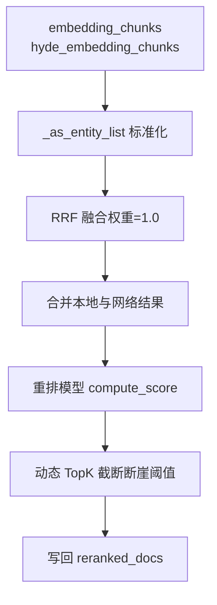
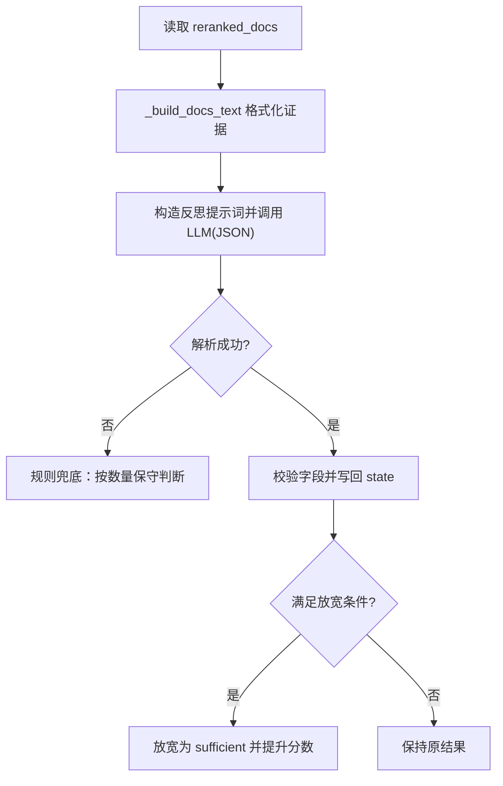
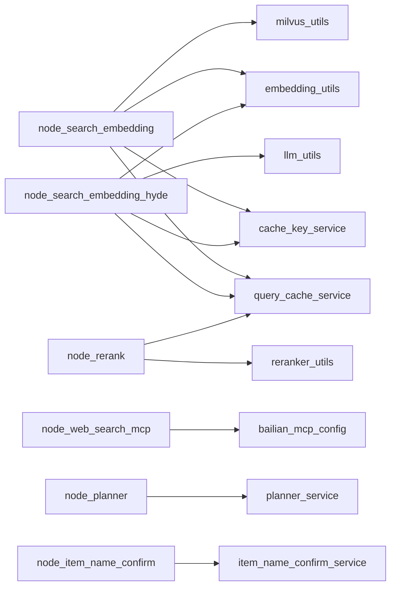

# 查询处理系统

<cite>
**本文引用的文件**
- [app/query_process/api/query_service.py](file://app/query_process/api/query_service.py)
- [app/query_process/agent/state.py](file://app/query_process/agent/state.py)
- [app/query_process/agent/services/planner_service.py](file://app/query_process/agent/services/planner_service.py)
- [app/query_process/agent/services/item_name_confirm_service.py](file://app/query_process/agent/services/item_name_confirm_service.py)
- [app/query_process/agent/nodes/node_planner.py](file://app/query_process/agent/nodes/node_planner.py)
- [app/query_process/agent/nodes/node_item_name_confirm.py](file://app/query_process/agent/nodes/node_item_name_confirm.py)
- [app/query_process/agent/nodes/node_search_embedding.py](file://app/query_process/agent/nodes/node_search_embedding.py)
- [app/query_process/agent/nodes/node_search_embedding_hyde.py](file://app/query_process/agent/nodes/node_search_embedding_hyde.py)
- [app/query_process/agent/nodes/node_web_search_mcp.py](file://app/query_process/agent/nodes/node_web_search_mcp.py)
- [app/query_process/agent/nodes/node_rrf.py](file://app/query_process/agent/nodes/node_rrf.py)
- [app/query_process/agent/nodes/node_rerank.py](file://app/query_process/agent/nodes/node_rerank.py)
- [app/query_process/agent/nodes/node_evidence_reflection.py](file://app/query_process/agent/nodes/node_evidence_reflection.py)
- [app/query_process/agent/services/cache_key_service.py](file://app/query_process/agent/services/cache_key_service.py)
- [app/query_process/agent/services/query_cache_service.py](file://app/query_process/agent/services/query_cache_service.py)
- [app/utils/sse_utils.py](file://app/utils/sse_utils.py)
- [app/utils/task_utils.py](file://app/utils/task_utils.py)
- [app/clients/mongo_history_utils.py](file://app/clients/mongo_history_utils.py)
- [app/clients/milvus_utils.py](file://app/clients/milvus_utils.py)
- [app/lm/embedding_utils.py](file://app/lm/embedding_utils.py)
- [app/lm/reranker_utils.py](file://app/lm/reranker_utils.py)
- [app/lm/llm_utils.py](file://app/lm/llm_utils.py)
- [app/config/bailian_mcp_config.py](file://app/config/bailian_mcp_config.py)
</cite>

## 目录
1. [简介](#简介)
2. [项目结构](#项目结构)
3. [核心组件](#核心组件)
4. [架构总览](#架构总览)
5. [详细组件分析](#详细组件分析)
6. [依赖分析](#依赖分析)
7. [性能考虑](#性能考虑)
8. [故障排查指南](#故障排查指南)
9. [结论](#结论)
10. [附录](#附录)

## 简介
本查询处理系统围绕「智能问答 + 多路检索 + 结果融合 + 证据反思 + 实时流式响应」构建，采用 LangGraph 控制流，将复杂的检索与生成过程分解为可维护、可观测、可缓存的节点化工作流。系统支持：
- 任务规划与路由：基于用户意图与历史上下文，动态选择检索策略与工具
- 商品确认：从问题中抽取并对齐标准实体名，必要时引导澄清
- 多路检索：本地向量检索、HyDE 假设文档检索、知识图谱检索、网络搜索
- 结果融合与重排：RRF 融合 + 重排模型动态截断
- 证据反思：从支持度、覆盖度、一致性三个维度评估证据充分性
- 查询状态管理、分层缓存、SSE 实时流式响应

## 项目结构
查询处理模块位于 app/query_process，核心分为三层：
- API 层：FastAPI 入口，负责请求解析、SSE 流式推送、历史查询与清理
- Agent 层：LangGraph 图与节点，串联规划、实体确认、检索、融合、反思、生成
- 服务层：规划器、实体确认、缓存键与查询缓存、嵌入与重排等可复用能力

图表来源
- [app/query_process/api/query_service.py:1-317](file://app/query_process/api/query_service.py#L1-L317)
- [app/query_process/agent/state.py:1-192](file://app/query_process/agent/state.py#L1-L192)
- [app/query_process/agent/nodes/node_planner.py:1-148](file://app/query_process/agent/nodes/node_planner.py#L1-L148)
- [app/query_process/agent/nodes/node_item_name_confirm.py:1-223](file://app/query_process/agent/nodes/node_item_name_confirm.py#L1-L223)
- [app/query_process/agent/nodes/node_search_embedding.py:1-163](file://app/query_process/agent/nodes/node_search_embedding.py#L1-L163)
- [app/query_process/agent/nodes/node_search_embedding_hyde.py:1-220](file://app/query_process/agent/nodes/node_search_embedding_hyde.py#L1-L220)
- [app/query_process/agent/nodes/node_web_search_mcp.py:1-304](file://app/query_process/agent/nodes/node_web_search_mcp.py#L1-L304)
- [app/query_process/agent/nodes/node_rrf.py:1-353](file://app/query_process/agent/nodes/node_rrf.py#L1-L353)
- [app/query_process/agent/nodes/node_rerank.py:1-256](file://app/query_process/agent/nodes/node_rerank.py#L1-L256)
- [app/query_process/agent/nodes/node_evidence_reflection.py:1-428](file://app/query_process/agent/nodes/node_evidence_reflection.py#L1-L428)
- [app/query_process/agent/services/cache_key_service.py:1-232](file://app/query_process/agent/services/cache_key_service.py#L1-L232)
- [app/query_process/agent/services/query_cache_service.py:1-287](file://app/query_process/agent/services/query_cache_service.py#L1-L287)
- [app/utils/sse_utils.py](file://app/utils/sse_utils.py)
- [app/utils/task_utils.py](file://app/utils/task_utils.py)
- [app/clients/mongo_history_utils.py](file://app/clients/mongo_history_utils.py)
- [app/clients/milvus_utils.py](file://app/clients/milvus_utils.py)
- [app/lm/embedding_utils.py](file://app/lm/embedding_utils.py)
- [app/lm/reranker_utils.py](file://app/lm/reranker_utils.py)
- [app/lm/llm_utils.py](file://app/lm/llm_utils.py)
- [app/config/bailian_mcp_config.py](file://app/config/bailian_mcp_config.py)

章节来源
- [app/query_process/api/query_service.py:1-317](file://app/query_process/api/query_service.py#L1-L317)
- [app/query_process/agent/state.py:1-192](file://app/query_process/agent/state.py#L1-L192)

## 核心组件
- 查询状态模型：QueryGraphState 定义贯穿全流程的状态字段，按输入层、规划层、检索层、治理与输出层组织
- 规划器：基于 LLM 与规则的意图识别与工具选择，支持缓存与规则纠偏
- 实体确认：抽取/对齐标准实体名，必要时引导澄清
- 检索层：本地向量检索、HyDE 假设文档检索、知识图谱检索、网络搜索（MCP）
- 融合与重排：RRF 融合 + 重排模型动态截断
- 证据反思：从支持度、覆盖度、一致性评估证据充分性
- 缓存体系：分阶段缓存键与 TTL 管理，覆盖规划、实体确认、检索、重排、答案
- 实时流式：SSE 队列与生成器，支持同步/流式两种响应模式

章节来源
- [app/query_process/agent/state.py:113-186](file://app/query_process/agent/state.py#L113-L186)
- [app/query_process/agent/services/planner_service.py:44-383](file://app/query_process/agent/services/planner_service.py#L44-L383)
- [app/query_process/agent/services/item_name_confirm_service.py:177-467](file://app/query_process/agent/services/item_name_confirm_service.py#L177-L467)
- [app/query_process/agent/services/cache_key_service.py:16-232](file://app/query_process/agent/services/cache_key_service.py#L16-L232)
- [app/query_process/agent/services/query_cache_service.py:1-287](file://app/query_process/agent/services/query_cache_service.py#L1-L287)

## 架构总览
系统采用「API → LangGraph 图 → 节点 → 服务/客户端」的分层架构。API 层负责请求接入与流式推送，Agent 层通过节点串联各处理步骤，服务层提供可复用的业务能力，客户端封装外部系统（向量库、历史库、MCP）。

图表来源
- [app/query_process/api/query_service.py:214-277](file://app/query_process/api/query_service.py#L214-L277)
- [app/query_process/agent/nodes/node_planner.py:56-148](file://app/query_process/agent/nodes/node_planner.py#L56-L148)
- [app/query_process/agent/nodes/node_item_name_confirm.py:89-223](file://app/query_process/agent/nodes/node_item_name_confirm.py#L89-L223)
- [app/query_process/agent/nodes/node_rrf.py:170-238](file://app/query_process/agent/nodes/node_rrf.py#L170-L238)
- [app/query_process/agent/nodes/node_rerank.py:29-101](file://app/query_process/agent/nodes/node_rerank.py#L29-L101)
- [app/query_process/agent/nodes/node_evidence_reflection.py:296-421](file://app/query_process/agent/nodes/node_evidence_reflection.py#L296-L421)

## 详细组件分析

### API 与状态管理
- API 入口提供 /query（同步/流式）、/stream/{session_id}（SSE）、/history/{session_id}（查询/清理历史）、/chat.html（调试页）、/health（健康检查）
- 状态装配器将请求参数组装为 QueryGraphState 初始字典，贯穿节点读写
- 流式模式通过 SSE 队列与生成器实时推送中间事件
- 任务状态管理记录节点运行轨迹，配合缓存统计

章节来源
- [app/query_process/api/query_service.py:74-317](file://app/query_process/api/query_service.py#L74-L317)
- [app/utils/sse_utils.py](file://app/utils/sse_utils.py)
- [app/utils/task_utils.py](file://app/utils/task_utils.py)

### 规划与路由（Planner）
- 构建规划提示词，要求 LLM 输出 JSON（意图、任务类型、工具、澄清需求、成功标准）
- 规则纠偏：针对型号、通用问答、比较类问题、泛化问题等进行策略修正
- 缓存：基于查询、历史、实体范围与提示/模型版本生成稳定键，支持 TTL

图表来源
- [app/query_process/agent/nodes/node_planner.py:56-148](file://app/query_process/agent/nodes/node_planner.py#L56-L148)
- [app/query_process/agent/services/planner_service.py:44-383](file://app/query_process/agent/services/planner_service.py#L44-L383)
- [app/query_process/agent/services/cache_key_service.py:53-84](file://app/query_process/agent/services/cache_key_service.py#L53-L84)
- [app/query_process/agent/services/query_cache_service.py:58-110](file://app/query_process/agent/services/query_cache_service.py#L58-L110)

章节来源
- [app/query_process/agent/nodes/node_planner.py:56-148](file://app/query_process/agent/nodes/node_planner.py#L56-L148)
- [app/query_process/agent/services/planner_service.py:44-383](file://app/query_process/agent/services/planner_service.py#L44-L383)

### 商品确认（Item Name Confirm）
- 第一阶段：抽取实体名并重写查询，LLM JSON 输出 + 规则兜底
- 第二阶段：向量召回标准实体候选，候选对齐与确认/选项分流
- 第三阶段：根据对齐结果写回 state，必要时引导澄清
- 缓存：基于原始查询、历史、任务类型与澄清需求生成键，避免重复确认

图表来源
- [app/query_process/agent/nodes/node_item_name_confirm.py:89-223](file://app/query_process/agent/nodes/node_item_name_confirm.py#L89-L223)
- [app/query_process/agent/services/item_name_confirm_service.py:177-467](file://app/query_process/agent/services/item_name_confirm_service.py#L177-L467)
- [app/query_process/agent/services/cache_key_service.py:165-183](file://app/query_process/agent/services/cache_key_service.py#L165-L183)
- [app/query_process/agent/services/query_cache_service.py:194-237](file://app/query_process/agent/services/query_cache_service.py#L194-L237)

章节来源
- [app/query_process/agent/nodes/node_item_name_confirm.py:89-223](file://app/query_process/agent/nodes/node_item_name_confirm.py#L89-L223)
- [app/query_process/agent/services/item_name_confirm_service.py:177-467](file://app/query_process/agent/services/item_name_confirm_service.py#L177-L467)

### 检索策略与缓存
- 本地向量检索（embedding）：生成 dense/sparse 向量，混合检索，支持 item_name 过滤
- HyDE 检索：先生成假设文档，再与查询组合进行检索
- 网络搜索（MCP）：通过阿里百炼 MCP SSE 工具调用 WebSearch，解析结构化结果
- 缓存：基于稳定查询键（含原始/重写查询、实体名、topk、索引版本等）与 TTL

图表来源
- [app/query_process/agent/nodes/node_search_embedding.py:38-107](file://app/query_process/agent/nodes/node_search_embedding.py#L38-L107)
- [app/query_process/agent/nodes/node_search_embedding_hyde.py:41-133](file://app/query_process/agent/nodes/node_search_embedding_hyde.py#L41-L133)
- [app/query_process/agent/nodes/node_web_search_mcp.py:47-163](file://app/query_process/agent/nodes/node_web_search_mcp.py#L47-L163)
- [app/query_process/agent/services/cache_key_service.py:16-36](file://app/query_process/agent/services/cache_key_service.py#L16-L36)
- [app/query_process/agent/services/query_cache_service.py:150-191](file://app/query_process/agent/services/query_cache_service.py#L150-L191)

章节来源
- [app/query_process/agent/nodes/node_search_embedding.py:38-163](file://app/query_process/agent/nodes/node_search_embedding.py#L38-L163)
- [app/query_process/agent/nodes/node_search_embedding_hyde.py:41-220](file://app/query_process/agent/nodes/node_search_embedding_hyde.py#L41-L220)
- [app/query_process/agent/nodes/node_web_search_mcp.py:47-304](file://app/query_process/agent/nodes/node_web_search_mcp.py#L47-L304)
- [app/query_process/agent/services/cache_key_service.py:16-36](file://app/query_process/agent/services/cache_key_service.py#L16-L36)
- [app/query_process/agent/services/query_cache_service.py:150-191](file://app/query_process/agent/services/query_cache_service.py#L150-L191)

### 融合与重排
- RRF 融合：对 embedding 与 hyde 两路召回进行倒数排名融合，统一实体结构后按权重累加
- 重排与动态截断：合并本地与网络结果，调用重排模型计算相关性分数，基于断崖式差距动态确定 TopK

图表来源
- [app/query_process/agent/nodes/node_rrf.py:170-238](file://app/query_process/agent/nodes/node_rrf.py#L170-L238)
- [app/query_process/agent/nodes/node_rerank.py:29-101](file://app/query_process/agent/nodes/node_rerank.py#L29-L101)

章节来源
- [app/query_process/agent/nodes/node_rrf.py:170-238](file://app/query_process/agent/nodes/node_rrf.py#L170-L238)
- [app/query_process/agent/nodes/node_rerank.py:29-256](file://app/query_process/agent/nodes/node_rerank.py#L29-L256)

### 证据反思与决策
- 证据反思：将重排后的证据格式化为文本，调用 LLM 输出 JSON（证据状态、缺失事实、引用、评分）
- 规则兜底：当 LLM 失败时按证据数量保守判断
- 放宽策略：在特定条件下（本地命中、参数/操作问答、多轮）放宽不足判定

图表来源
- [app/query_process/agent/nodes/node_evidence_reflection.py:296-421](file://app/query_process/agent/nodes/node_evidence_reflection.py#L296-L421)

章节来源
- [app/query_process/agent/nodes/node_evidence_reflection.py:296-428](file://app/query_process/agent/nodes/node_evidence_reflection.py#L296-L428)

### 缓存机制与键设计
- 缓存键：规划/实体确认/检索/重排/答案分别有稳定键生成，包含查询、历史、实体范围、候选标识、版本信息
- TTL：各阶段缓存可配置 TTL，避免陈旧策略与模型升级后复用
- 统计：记录阶段命中与后端缓存快照，便于观测与调优

章节来源
- [app/query_process/agent/services/cache_key_service.py:16-232](file://app/query_process/agent/services/cache_key_service.py#L16-L232)
- [app/query_process/agent/services/query_cache_service.py:1-287](file://app/query_process/agent/services/query_cache_service.py#L1-L287)

## 依赖分析
- 节点与服务：节点通过服务层解耦规则与业务逻辑，降低耦合度
- 外部依赖：向量库（Milvus）、历史库（Mongo）、MCP（百炼 WebSearch）、重排模型、嵌入模型
- 环状风险：节点间通过共享状态传递，需确保字段命名与类型一致性，避免隐式约定

图表来源
- [app/query_process/agent/nodes/node_search_embedding.py:17-27](file://app/query_process/agent/nodes/node_search_embedding.py#L17-L27)
- [app/query_process/agent/nodes/node_search_embedding_hyde.py:18-30](file://app/query_process/agent/nodes/node_search_embedding_hyde.py#L18-L30)
- [app/query_process/agent/nodes/node_web_search_mcp.py:23-31](file://app/query_process/agent/nodes/node_web_search_mcp.py#L23-L31)
- [app/query_process/agent/nodes/node_rerank.py:16-20](file://app/query_process/agent/nodes/node_rerank.py#L16-L20)
- [app/query_process/agent/nodes/node_planner.py:16-19](file://app/query_process/agent/nodes/node_planner.py#L16-L19)
- [app/query_process/agent/nodes/node_item_name_confirm.py:18-23](file://app/query_process/agent/nodes/node_item_name_confirm.py#L18-L23)

章节来源
- [app/query_process/agent/nodes/node_search_embedding.py:17-27](file://app/query_process/agent/nodes/node_search_embedding.py#L17-L27)
- [app/query_process/agent/nodes/node_search_embedding_hyde.py:18-30](file://app/query_process/agent/nodes/node_search_embedding_hyde.py#L18-L30)
- [app/query_process/agent/nodes/node_web_search_mcp.py:23-31](file://app/query_process/agent/nodes/node_web_search_mcp.py#L23-L31)
- [app/query_process/agent/nodes/node_rerank.py:16-20](file://app/query_process/agent/nodes/node_rerank.py#L16-L20)
- [app/query_process/agent/nodes/node_planner.py:16-19](file://app/query_process/agent/nodes/node_planner.py#L16-L19)
- [app/query_process/agent/nodes/node_item_name_confirm.py:18-23](file://app/query_process/agent/nodes/node_item_name_confirm.py#L18-L23)

## 性能考虑
- 缓存优先：规划、实体确认、检索、重排、答案均提供缓存，显著降低重复请求成本
- 检索优化：向量生成与 Milvus 混合检索，结合 item_name 过滤缩小召回范围
- 融合与截断：RRF 降低单一来源偏差；重排动态截断避免无效长尾
- 异步 MCP：同步节点内桥接异步调用，避免阻塞主线程
- 流式推送：SSE 实时反馈中间状态，改善用户体验

## 故障排查指南
- 规划失败：检查提示词加载与 LLM JSON 解析，查看规则纠偏日志
- 实体确认异常：关注向量客户端与 Milvus 连接、候选对齐阈值与兜底策略
- 检索无结果：确认 COLLECTION 环境变量、item_name 过滤表达式、向量维度
- 网络搜索失败：检查 MCP 配置、鉴权头、SSE 超时与异步桥接
- 证据反思失败：查看兜底策略与放宽条件，确认 reranked_docs 格式
- 缓存未命中：核对缓存键生成与 TTL，确认版本号变更导致失效

章节来源
- [app/query_process/agent/services/planner_service.py:289-383](file://app/query_process/agent/services/planner_service.py#L289-L383)
- [app/query_process/agent/services/item_name_confirm_service.py:238-312](file://app/query_process/agent/services/item_name_confirm_service.py#L238-L312)
- [app/query_process/agent/nodes/node_search_embedding.py:110-163](file://app/query_process/agent/nodes/node_search_embedding.py#L110-L163)
- [app/query_process/agent/nodes/node_web_search_mcp.py:169-264](file://app/query_process/agent/nodes/node_web_search_mcp.py#L169-L264)
- [app/query_process/agent/nodes/node_evidence_reflection.py:380-421](file://app/query_process/agent/nodes/node_evidence_reflection.py#L380-L421)
- [app/query_process/agent/services/query_cache_service.py:21-32](file://app/query_process/agent/services/query_cache_service.py#L21-L32)

## 结论
本系统通过清晰的分层与节点化设计，实现了从意图规划到证据反思的闭环查询流程。借助多路检索与融合重排，结合分层缓存与实时流式响应，既保证了回答质量，也兼顾了性能与可观测性。建议在生产环境中持续监控缓存命中率、重排耗时与 MCP 成功率，并根据业务反馈迭代规划与反思规则。

## 附录

### API 参考
- POST /query
  - 请求体：{ query: string, session_id?: string, is_stream?: boolean }
  - 响应：同步返回 { message, session_id, answer, done_list, cache_stats }；流式返回 { message, session_id }
- GET /stream/{session_id}
  - 返回 Server-Sent Events，实时推送中间事件
- GET /history/{session_id}?limit=50
  - 返回会话历史记录
- DELETE /history/{session_id}
  - 清空历史记录
- GET /chat.html
  - 内置调试页面
- GET /health
  - 健康检查

章节来源
- [app/query_process/api/query_service.py:214-307](file://app/query_process/api/query_service.py#L214-L307)

### 查询状态字段说明（节选）
- 输入层：original_query, rewritten_query, session_id, is_stream, history, item_names
- 规划层：intent_type, task_type, retrieval_plan, selected_tools, need_clarify, clarification_question
- 检索层：embedding_chunks, hyde_embedding_chunks, kg_chunks, web_search_docs, rrf_chunks, reranked_docs
- 治理与输出层：evidence_status, reflection_reason, missing_facts, citations, final_confidence, support_score, coverage_score, consistency_score, prompt, answer, cache_stats

章节来源
- [app/query_process/agent/state.py:113-186](file://app/query_process/agent/state.py#L113-L186)