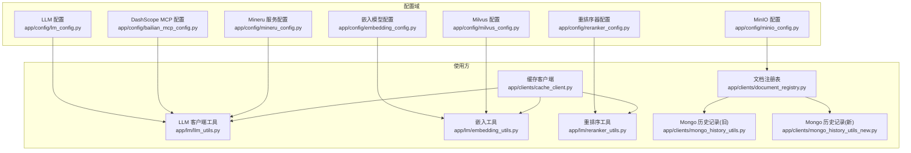
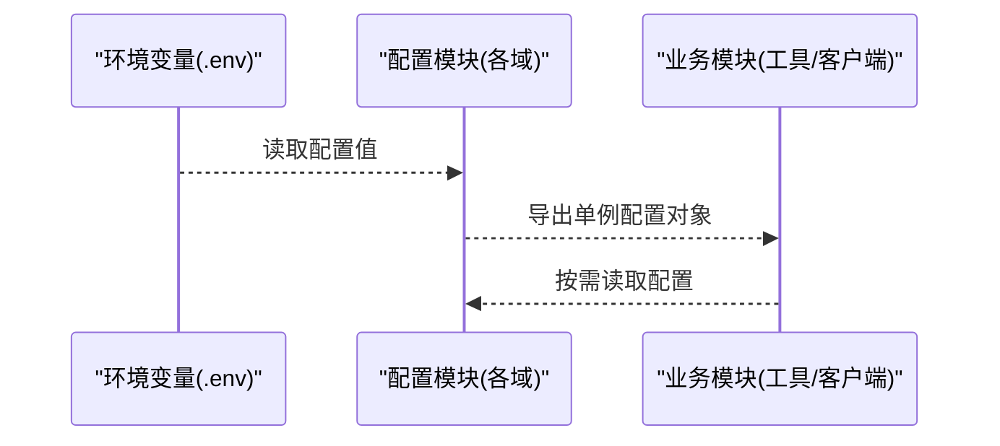
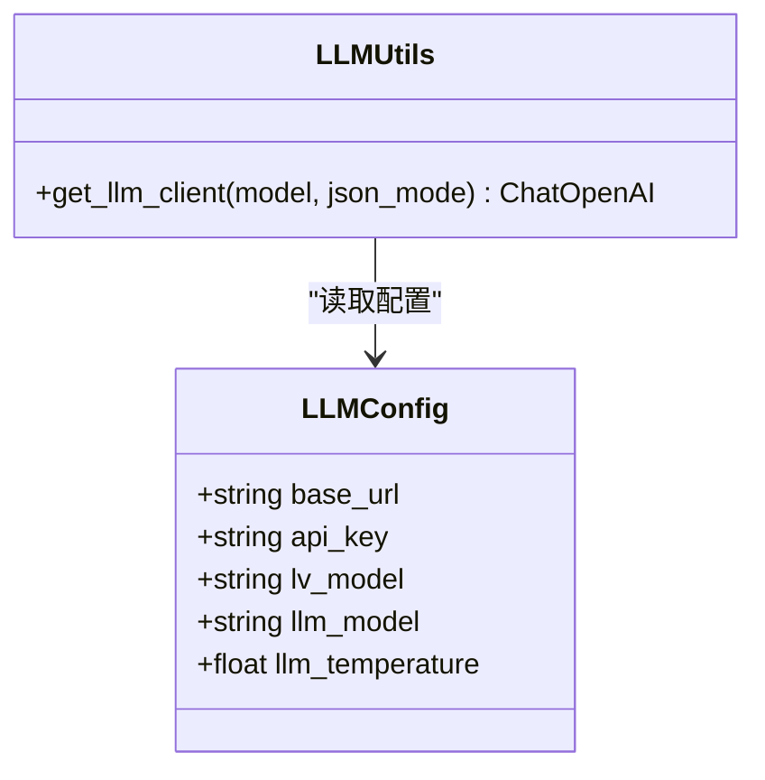
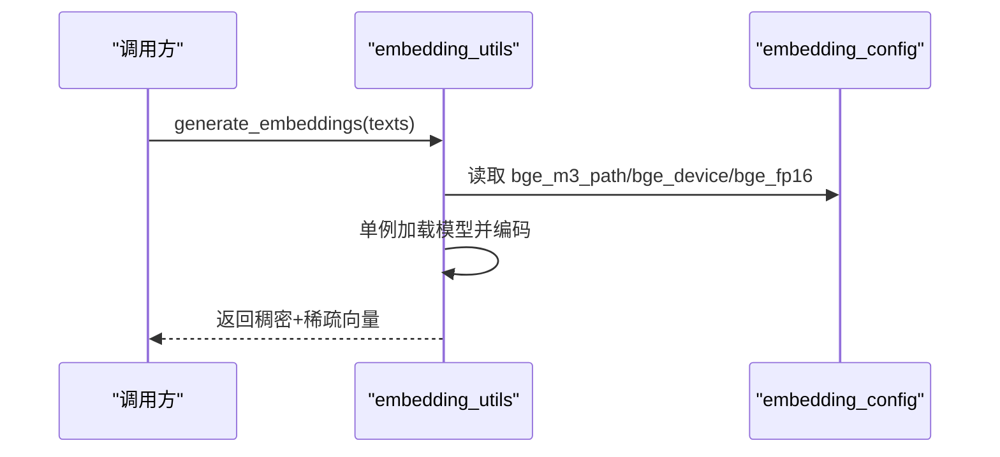
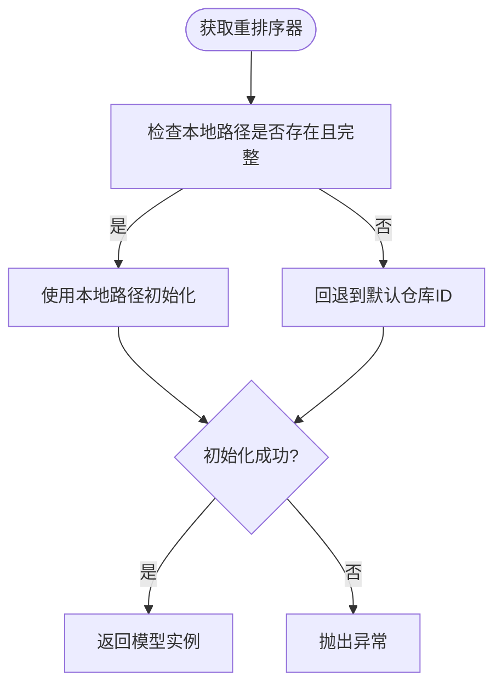
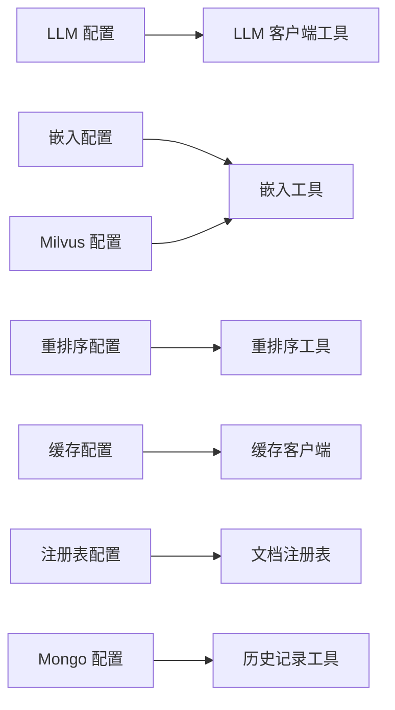

# 配置管理系统

<cite>
**本文引用的文件**
- [app/config/lm_config.py](file://app/config/lm_config.py)
- [app/config/embedding_config.py](file://app/config/embedding_config.py)
- [app/config/reranker_config.py](file://app/config/reranker_config.py)
- [app/config/milvus_config.py](file://app/config/milvus_config.py)
- [app/config/minio_config.py](file://app/config/minio_config.py)
- [app/config/bailian_mcp_config.py](file://app/config/bailian_mcp_config.py)
- [app/config/mineru_config.py](file://app/config/mineru_config.py)
- [app/lm/llm_utils.py](file://app/lm/llm_utils.py)
- [app/lm/embedding_utils.py](file://app/lm/embedding_utils.py)
- [app/lm/reranker_utils.py](file://app/lm/reranker_utils.py)
- [app/clients/cache_client.py](file://app/clients/cache_client.py)
- [app/clients/document_registry.py](file://app/clients/document_registry.py)
- [app/clients/mongo_history_utils.py](file://app/clients/mongo_history_utils.py)
- [app/clients/mongo_history_utils_new.py](file://app/clients/mongo_history_utils_new.py)
</cite>

## 目录
1. [简介](#简介)
2. [项目结构](#项目结构)
3. [核心组件](#核心组件)
4. [架构总览](#架构总览)
5. [详细组件分析](#详细组件分析)
6. [依赖分析](#依赖分析)
7. [性能考虑](#性能考虑)
8. [故障排除指南](#故障排除指南)
9. [结论](#结论)
10. [附录](#附录)

## 简介
本文件系统性梳理配置管理子系统，覆盖LLM、嵌入模型、重排序器、数据库与对象存储、缓存与注册表等配置项的来源、参数含义、默认行为与最佳实践。文档同时给出环境变量清单、配置验证策略、动态更新方案、多环境部署示例、安全建议与性能调优要点，帮助管理员正确配置系统。

## 项目结构
配置管理采用“按功能域分文件”的组织方式，每个配置域独立为一个模块，集中读取环境变量并导出单例配置对象，供各业务模块按需注入使用。

图表来源
- [app/config/lm_config.py:1-33](file://app/config/lm_config.py#L1-L33)
- [app/config/embedding_config.py:1-31](file://app/config/embedding_config.py#L1-L31)
- [app/config/reranker_config.py:1-28](file://app/config/reranker_config.py#L1-L28)
- [app/config/milvus_config.py:1-33](file://app/config/milvus_config.py#L1-L33)
- [app/config/minio_config.py:1-35](file://app/config/minio_config.py#L1-L35)
- [app/config/bailian_mcp_config.py:1-39](file://app/config/bailian_mcp_config.py#L1-L39)
- [app/config/mineru_config.py:1-33](file://app/config/mineru_config.py#L1-L33)
- [app/lm/llm_utils.py:1-107](file://app/lm/llm_utils.py#L1-L107)
- [app/lm/embedding_utils.py:1-117](file://app/lm/embedding_utils.py#L1-L117)
- [app/lm/reranker_utils.py:1-224](file://app/lm/reranker_utils.py#L1-L224)
- [app/clients/cache_client.py:1-247](file://app/clients/cache_client.py#L1-L247)
- [app/clients/document_registry.py:1-219](file://app/clients/document_registry.py#L1-L219)
- [app/clients/mongo_history_utils.py:1-253](file://app/clients/mongo_history_utils.py#L1-L253)
- [app/clients/mongo_history_utils_new.py:1-248](file://app/clients/mongo_history_utils_new.py#L1-L248)

章节来源
- [app/config/lm_config.py:1-33](file://app/config/lm_config.py#L1-L33)
- [app/config/embedding_config.py:1-31](file://app/config/embedding_config.py#L1-L31)
- [app/config/reranker_config.py:1-28](file://app/config/reranker_config.py#L1-L28)
- [app/config/milvus_config.py:1-33](file://app/config/milvus_config.py#L1-L33)
- [app/config/minio_config.py:1-35](file://app/config/minio_config.py#L1-L35)
- [app/config/bailian_mcp_config.py:1-39](file://app/config/bailian_mcp_config.py#L1-L39)
- [app/config/mineru_config.py:1-33](file://app/config/mineru_config.py#L1-L33)

## 核心组件
- LLM 配置：集中管理大模型服务的基础地址、API 密钥、默认模型与温度等参数，供 LLM 客户端工具统一读取。
- 嵌入模型配置：集中管理 BGE-M3 的本地路径、仓库标识、设备与半精度开关，供嵌入工具统一读取。
- 重排序器配置：集中管理 BGE-Reranker 的本地路径、设备与半精度开关，供重排序工具统一读取。
- Milvus 配置：集中管理向量数据库连接地址与集合名称，供嵌入与检索相关模块使用。
- MinIO 配置：集中管理对象存储的访问端点、凭据、桶名与目录等，供文档注册表等模块使用。
- DashScope MCP 配置：集中管理 MCP 服务的基础地址与 API Key，供需要 MCP 的查询流程使用。
- Mineru 服务配置：集中管理 Mineru 的基础地址、API Token 与代理绕过策略，供需要 Mineru 的查询流程使用。
- 缓存配置：集中管理缓存后端选择与 Redis 连接串，供查询侧缓存统一使用。
- 文档注册表配置：集中管理 Mongo 与本地 JSON 的回退策略、集合名称等，供导入/注册流程使用。
- 历史对话记录配置：集中管理 Mongo 连接串与数据库名，供历史记录读写模块使用。

章节来源
- [app/config/lm_config.py:11-26](file://app/config/lm_config.py#L11-L26)
- [app/config/embedding_config.py:9-24](file://app/config/embedding_config.py#L9-L24)
- [app/config/reranker_config.py:9-21](file://app/config/reranker_config.py#L9-L21)
- [app/config/milvus_config.py:12-26](file://app/config/milvus_config.py#L12-L26)
- [app/config/minio_config.py:17-34](file://app/config/minio_config.py#L17-L34)
- [app/config/bailian_mcp_config.py:22-31](file://app/config/bailian_mcp_config.py#L22-L31)
- [app/config/mineru_config.py:10-21](file://app/config/mineru_config.py#L10-L21)
- [app/clients/cache_client.py:129-140](file://app/clients/cache_client.py#L129-L140)
- [app/clients/document_registry.py:27-28](file://app/clients/document_registry.py#L27-L28)
- [app/clients/mongo_history_utils.py:32-43](file://app/clients/mongo_history_utils.py#L32-L43)

## 架构总览
配置系统遵循“单一职责、集中读取、按需注入”的原则：每个配置域模块负责读取一组相关环境变量并导出单例配置对象；业务模块通过导入配置对象来获取所需参数，避免散落的环境变量读取逻辑。

图表来源
- [app/config/lm_config.py:6-8](file://app/config/lm_config.py#L6-L8)
- [app/config/embedding_config.py:6-7](file://app/config/embedding_config.py#L6-L7)
- [app/config/reranker_config.py:6-7](file://app/config/reranker_config.py#L6-L7)
- [app/config/milvus_config.py:6-7](file://app/config/milvus_config.py#L6-L7)
- [app/config/minio_config.py:6-7](file://app/config/minio_config.py#L6-L7)
- [app/config/bailian_mcp_config.py:6-6](file://app/config/bailian_mcp_config.py#L6-L6)
- [app/config/mineru_config.py:6-8](file://app/config/mineru_config.py#L6-L8)
- [app/lm/llm_utils.py:9-9](file://app/lm/llm_utils.py#L9-L9)
- [app/lm/embedding_utils.py:2-3](file://app/lm/embedding_utils.py#L2-L3)
- [app/lm/reranker_utils.py:27-28](file://app/lm/reranker_utils.py#L27-L28)

## 详细组件分析

### LLM 配置域
- 作用：统一管理大模型服务的接入参数，包括基础地址、API 密钥、默认模型与温度。
- 关键参数
  - OPENAI_API_BASE：大模型服务基础地址（适配国产模型代理地址）
  - OPENAI_API_KEY：API 密钥
  - VL_MODEL：多模态模型标识（如 qwen-vl-plus）
  - LLM_DEFAULT_MODEL：默认 LLM 模型名
  - LLM_DEFAULT_TEMPERATURE：默认温度（0~1，越低越确定）
- 使用方式：LLM 客户端工具按需读取配置，支持缓存机制与 JSON 输出模式。
- 最佳实践
  - 在 .env 中设置 OPENAI_API_BASE 与 OPENAI_API_KEY，确保初始化时可用。
  - 根据场景调整温度，推理类任务建议较低温度。
  - 使用 JSON 输出模式时，确保模型支持 response_format=json_object。
- 动态更新：当前实现为一次性读取环境变量并缓存配置对象，不支持热更新；可通过重启进程使新环境变量生效。

图表来源
- [app/config/lm_config.py:12-26](file://app/config/lm_config.py#L12-L26)
- [app/lm/llm_utils.py:17-73](file://app/lm/llm_utils.py#L17-L73)

章节来源
- [app/config/lm_config.py:11-26](file://app/config/lm_config.py#L11-L26)
- [app/lm/llm_utils.py:17-73](file://app/lm/llm_utils.py#L17-L73)

### 嵌入模型配置域
- 作用：统一管理 BGE-M3 嵌入模型的本地路径、仓库标识、设备与半精度开关。
- 关键参数
  - BGE_M3_PATH：本地模型路径（优先使用）
  - BGE_M3：模型仓库标识（如 BAAI/bge-m3）
  - BGE_DEVICE：运行设备（cuda:0/cpu）
  - BGE_FP16：是否启用半精度（1/true/True 视为真）
- 使用方式：嵌入工具通过单例模式加载模型，自动适配 Milvus IP 内积检索所需的 L2 归一化。
- 最佳实践
  - 本地部署优先使用 BGE_M3_PATH，确保网络稳定与加载速度。
  - GPU 推理时开启 BGE_FP16 可降低显存占用，但可能影响精度。
  - 返回的稠密/稀疏向量已适配序列化与 Milvus 入库。
- 动态更新：当前实现为一次性读取环境变量并缓存模型实例，不支持热更新；可通过重启进程使新配置生效。

图表来源
- [app/lm/embedding_utils.py:8-49](file://app/lm/embedding_utils.py#L8-L49)
- [app/config/embedding_config.py:18-24](file://app/config/embedding_config.py#L18-L24)

章节来源
- [app/config/embedding_config.py:9-24](file://app/config/embedding_config.py#L9-L24)
- [app/lm/embedding_utils.py:8-49](file://app/lm/embedding_utils.py#L8-L49)

### 重排序器配置域
- 作用：统一管理 BGE-Reranker 的本地路径、设备与半精度开关。
- 关键参数
  - BGE_RERANKER_LARGE：本地模型路径
  - BGE_RERANKER_DEVICE：运行设备（cuda:0/cpu）
  - BGE_RERANKER_FP16：是否启用半精度
- 使用方式：重排序工具通过单例模式加载模型，支持本地路径与仓库 ID 回退策略。
- 最佳实践
  - 本地路径优先，若不完整或不可用则回退到默认仓库 ID。
  - GPU 推理时开启半精度可节省显存。
  - compute_score 输入为“问题-文档”二元组列表，输出分数越高相关性越强。
- 动态更新：当前实现为一次性读取环境变量并缓存模型实例，不支持热更新；可通过重启进程使新配置生效。

图表来源
- [app/lm/reranker_utils.py:158-216](file://app/lm/reranker_utils.py#L158-L216)
- [app/config/reranker_config.py:16-21](file://app/config/reranker_config.py#L16-L21)

章节来源
- [app/config/reranker_config.py:9-21](file://app/config/reranker_config.py#L9-L21)
- [app/lm/reranker_utils.py:158-216](file://app/lm/reranker_utils.py#L158-L216)

### Milvus 配置域
- 作用：统一管理 Milvus 服务连接地址与集合名称。
- 关键参数
  - MILVUS_URL：服务端连接地址
  - CHUNKS_COLLECTION：存储切片的集合名称
  - ENTITY_NAME_COLLECTION：预留-实体名称集合
  - ITEM_NAME_COLLECTION：存储文档对应实体类的集合名称
- 使用方式：嵌入工具在生成向量后，结合 Milvus 集合名称进行入库与检索。
- 最佳实践
  - 确保 CHUNKS_COLLECTION 与 ITEM_NAME_COLLECTION 与导入流程一致。
  - 生产环境建议使用内网域名与高可用地址。
- 动态更新：当前实现为一次性读取环境变量，不支持热更新；可通过重启进程使新配置生效。

章节来源
- [app/config/milvus_config.py:12-26](file://app/config/milvus_config.py#L12-L26)
- [app/lm/embedding_utils.py:21-23](file://app/lm/embedding_utils.py#L21-L23)

### MinIO 配置域
- 作用：统一管理对象存储的访问端点、凭据、桶名与目录。
- 关键参数
  - MINIO_ENDPOINT：访问端点
  - MINIO_ACCESS_KEY：访问密钥
  - MINIO_SECRET_KEY：私有密钥
  - MINIO_BUCKET_NAME：桶名
  - MINIO_SECURE：是否启用 HTTPS（1/true/yes/on 视为真）
  - MINIO_IMG_DIR：图片目录
- 使用方式：文档注册表等模块通过配置连接对象存储，用于图片/附件等资源管理。
- 最佳实践
  - 生产环境务必启用 MINIO_SECURE 并使用强口令。
  - 桶名与目录需与前端/导入流程约定一致。
- 动态更新：当前实现为一次性读取环境变量，不支持热更新；可通过重启进程使新配置生效。

章节来源
- [app/config/minio_config.py:17-34](file://app/config/minio_config.py#L17-L34)
- [app/clients/document_registry.py:27-28](file://app/clients/document_registry.py#L27-L28)

### DashScope MCP 配置域
- 作用：统一管理 MCP 服务的基础地址与 API Key。
- 关键参数
  - MCP_DASHSCOPE_BASE_URL：MCP 基础地址（内置 URL 正规化逻辑）
  - DASHSCOPE_API_KEY：DashScope API Key
- 使用方式：MCP 配置经正规化后供查询流程使用。
- 最佳实践
  - 基础地址末尾含 “/sse” 时会被自动替换为 “/mcp”，大小写差异也会被规范化。
- 动态更新：当前实现为一次性读取环境变量，不支持热更新；可通过重启进程使新配置生效。

章节来源
- [app/config/bailian_mcp_config.py:9-31](file://app/config/bailian_mcp_config.py#L9-L31)

### Mineru 服务配置域
- 作用：统一管理 Mineru 的基础地址、API Token 与代理绕过策略。
- 关键参数
  - MINERU_BASE_URL：服务基础地址
  - MINERU_API_TOKEN：API Token
  - MINERU_BYPASS_PROXY：是否绕过代理（默认 true）
- 使用方式：Mineru 配置对象与导出常量供查询流程使用。
- 最佳实践
  - 企业内网部署时可开启 MINERU_BYPASS_PROXY 以提升稳定性。
- 动态更新：当前实现为一次性读取环境变量，不支持热更新；可通过重启进程使新配置生效。

章节来源
- [app/config/mineru_config.py:10-25](file://app/config/mineru_config.py#L10-L25)

### 缓存配置域
- 作用：统一管理缓存后端选择与 Redis 连接串。
- 关键参数
  - CACHE_BACKEND：后端类型（memory/redis）
  - CACHE_REDIS_URL 或 REDIS_URL：Redis 连接串
- 使用方式：缓存客户端根据配置选择内存或 Redis 后端，提供统一的 get/set/delete/clear 接口。
- 最佳实践
  - 生产环境推荐使用 Redis 后端，确保多实例共享缓存。
  - Redis 连接串需包含鉴权信息与超时设置。
- 动态更新：当前实现为一次性构建后端实例，不支持热切换；可通过重启进程使新配置生效。

章节来源
- [app/clients/cache_client.py:129-140](file://app/clients/cache_client.py#L129-L140)
- [app/clients/cache_client.py:209-226](file://app/clients/cache_client.py#L209-L226)

### 文档注册表配置域
- 作用：统一管理 Mongo 与本地 JSON 的回退策略、集合名称。
- 关键参数
  - IMPORT_DOCUMENTS_COLLECTION：文档集合名（默认 import_documents）
  - IMPORT_DOCUMENT_CHUNKS_COLLECTION：分片集合名（默认 import_document_chunks）
  - MONGO_URL：MongoDB 连接串
  - MONGO_DB_NAME：数据库名
- 使用方式：注册表优先使用 Mongo，若缺少配置则回退到本地 JSON 文件，保证开发环境可用。
- 最佳实践
  - 生产环境务必配置 MONGO_URL 与 MONGO_DB_NAME，避免回退到本地 JSON。
  - 确保集合索引已创建，保障查询性能。
- 动态更新：当前实现为一次性构建后端实例，不支持热切换；可通过重启进程使新配置生效。

章节来源
- [app/clients/document_registry.py:27-28](file://app/clients/document_registry.py#L27-L28)
- [app/clients/document_registry.py:128-142](file://app/clients/document_registry.py#L128-L142)

### 历史对话记录配置域
- 作用：统一管理 Mongo 连接串与数据库名，提供历史记录的读写接口。
- 关键参数
  - MONGO_URL：MongoDB 连接串
  - MONGO_DB_NAME：数据库名
- 使用方式：历史记录工具类通过单例模式连接数据库，提供清空、保存、更新与查询接口。
- 最佳实践
  - 生产环境务必配置 MONGO_URL 与 MONGO_DB_NAME。
  - 为 chat_message 集合创建复合索引以提升查询性能。
- 动态更新：当前实现为一次性构建客户端实例，不支持热切换；可通过重启进程使新配置生效。

章节来源
- [app/clients/mongo_history_utils.py:32-48](file://app/clients/mongo_history_utils.py#L32-L48)
- [app/clients/mongo_history_utils_new.py:33-49](file://app/clients/mongo_history_utils_new.py#L33-L49)

## 依赖分析
- 配置域与使用方的耦合度低：配置域仅负责读取与导出，使用方通过导入配置对象解耦。
- 环境变量加载策略：多数配置模块在导入时即加载 .env，确保后续读取可用；部分模块在运行时按需读取。
- 依赖链路
  - LLM 客户端工具依赖 LLM 配置
  - 嵌入工具依赖嵌入配置与 Milvus 配置
  - 重排序工具依赖重排序配置
  - 缓存客户端依赖缓存配置
  - 文档注册表依赖 Mongo/MinIO 配置
  - 历史记录工具依赖 Mongo 配置

图表来源
- [app/config/lm_config.py:20-26](file://app/config/lm_config.py#L20-L26)
- [app/config/embedding_config.py:18-24](file://app/config/embedding_config.py#L18-L24)
- [app/config/milvus_config.py:21-26](file://app/config/milvus_config.py#L21-L26)
- [app/config/reranker_config.py:16-21](file://app/config/reranker_config.py#L16-L21)
- [app/clients/cache_client.py:129-140](file://app/clients/cache_client.py#L129-L140)
- [app/clients/document_registry.py:27-28](file://app/clients/document_registry.py#L27-L28)
- [app/clients/mongo_history_utils.py:32-43](file://app/clients/mongo_history_utils.py#L32-L43)

## 性能考虑
- 模型加载与缓存
  - 嵌入与重排序工具均采用单例模式，避免重复初始化带来的 CPU/显存开销。
  - 建议在生产环境使用 GPU 与半精度（BGE_FP16/BGE_RERANKER_FP16）以提升吞吐。
- LLM 客户端缓存
  - LLM 客户端工具按“模型名+JSON模式”缓存实例，减少重复初始化成本。
  - 合理设置温度与输出格式，有助于稳定响应时间。
- 缓存后端
  - Redis 后端适合多实例共享，建议在生产环境启用并配置合理的 TTL。
- 数据库索引
  - 历史记录工具为 chat_message 集合创建复合索引，显著提升按会话查询性能。
- 向量检索
  - 嵌入工具开启 L2 归一化，适配 Milvus IP 内积检索，兼顾速度与精度。

[本节为通用指导，不直接分析具体文件，故无章节来源]

## 故障排除指南
- 环境变量未生效
  - 确认 .env 文件路径与权限正确，且配置模块在导入时已执行 load_dotenv。
  - 检查变量名拼写与大小写，布尔值需使用 1/true/yes/on 等形式。
- LLM 初始化失败
  - 检查 OPENAI_API_KEY 与 OPENAI_API_BASE 是否正确配置。
  - 确认模型名与响应格式参数（如 JSON 模式）与服务端兼容。
- 嵌入模型加载失败
  - 检查 BGE_M3_PATH 是否存在且包含完整权重文件；否则回退到仓库 ID。
  - 确认设备与半精度设置与硬件能力匹配。
- 重排序器初始化失败
  - 检查本地路径完整性；必要时清理临时目录并重新下载。
- 缓存后端异常
  - Redis 连接串需包含鉴权信息；若缺少则回退到内存后端。
- Mongo 连接失败
  - 检查 MONGO_URL 与 MONGO_DB_NAME；确认网络连通与认证信息。
- MinIO 连接失败
  - 检查端点、凭据与桶名；生产环境务必启用 HTTPS。

章节来源
- [app/lm/llm_utils.py:40-43](file://app/lm/llm_utils.py#L40-L43)
- [app/lm/embedding_utils.py:47-49](file://app/lm/embedding_utils.py#L47-L49)
- [app/lm/reranker_utils.py:210-215](file://app/lm/reranker_utils.py#L210-L215)
- [app/clients/cache_client.py:136-138](file://app/clients/cache_client.py#L136-L138)
- [app/clients/mongo_history_utils.py:32-43](file://app/clients/mongo_history_utils.py#L32-L43)
- [app/clients/mongo_history_utils_new.py:33-49](file://app/clients/mongo_history_utils_new.py#L33-L49)
- [app/config/minio_config.py:28-33](file://app/config/minio_config.py#L28-L33)

## 结论
本配置管理系统通过“按域分文件、集中读取、按需注入”的方式，实现了 LLM、嵌入、重排序、数据库与对象存储、缓存与注册表等关键配置的统一管理。建议在生产环境中严格管理 .env 文件、启用 HTTPS、合理配置缓存与索引，并通过重启进程应用配置变更，以获得稳定与高性能的运行效果。

[本节为总结性内容，不直接分析具体文件，故无章节来源]

## 附录

### 环境变量清单与默认值
- LLM 相关
  - OPENAI_API_BASE：大模型服务基础地址（必填）
  - OPENAI_API_KEY：API 密钥（必填）
  - VL_MODEL：多模态模型标识（可选）
  - LLM_DEFAULT_MODEL：默认 LLM 模型名（可选）
  - LLM_DEFAULT_TEMPERATURE：默认温度（可选，默认约 0.1）
- 嵌入模型相关
  - BGE_M3_PATH：本地模型路径（可选）
  - BGE_M3：模型仓库标识（可选，默认 BAAI/bge-m3）
  - BGE_DEVICE：运行设备（可选，默认 cpu）
  - BGE_FP16：是否启用半精度（可选，默认 False）
- 重排序器相关
  - BGE_RERANKER_LARGE：本地模型路径（可选）
  - BGE_RERANKER_DEVICE：运行设备（可选，默认 cpu）
  - BGE_RERANKER_FP16：是否启用半精度（可选，默认 False）
- Milvus 相关
  - MILVUS_URL：服务端连接地址（可选）
  - CHUNKS_COLLECTION：切片集合名（可选）
  - ENTITY_NAME_COLLECTION：实体名称集合名（可选）
  - ITEM_NAME_COLLECTION：实体类集合名（可选）
- MinIO 相关
  - MINIO_ENDPOINT：访问端点（可选）
  - MINIO_ACCESS_KEY：访问密钥（可选）
  - MINIO_SECRET_KEY：私有密钥（可选）
  - MINIO_BUCKET_NAME：桶名（可选）
  - MINIO_SECURE：是否启用 HTTPS（可选，默认 False）
  - MINIO_IMG_DIR：图片目录（可选）
- DashScope MCP 相关
  - MCP_DASHSCOPE_BASE_URL：MCP 基础地址（可选）
  - DASHSCOPE_API_KEY：DashScope API Key（可选）
- Mineru 相关
  - MINERU_BASE_URL：服务基础地址（可选）
  - MINERU_API_TOKEN：API Token（可选）
  - MINERU_BYPASS_PROXY：是否绕过代理（可选，默认 true）
- 缓存相关
  - CACHE_BACKEND：后端类型 memory/redis（可选，默认 memory）
  - CACHE_REDIS_URL 或 REDIS_URL：Redis 连接串（可选）
- 文档注册表相关
  - IMPORT_DOCUMENTS_COLLECTION：文档集合名（可选，默认 import_documents）
  - IMPORT_DOCUMENT_CHUNKS_COLLECTION：分片集合名（可选，默认 import_document_chunks）
  - MONGO_URL：MongoDB 连接串（可选）
  - MONGO_DB_NAME：数据库名（可选）

章节来源
- [app/config/lm_config.py:20-26](file://app/config/lm_config.py#L20-L26)
- [app/config/embedding_config.py:18-24](file://app/config/embedding_config.py#L18-L24)
- [app/config/reranker_config.py:16-21](file://app/config/reranker_config.py#L16-L21)
- [app/config/milvus_config.py:21-26](file://app/config/milvus_config.py#L21-L26)
- [app/config/minio_config.py:27-34](file://app/config/minio_config.py#L27-L34)
- [app/config/bailian_mcp_config.py:28-31](file://app/config/bailian_mcp_config.py#L28-L31)
- [app/config/mineru_config.py:17-21](file://app/config/mineru_config.py#L17-L21)
- [app/clients/cache_client.py:129-140](file://app/clients/cache_client.py#L129-L140)
- [app/clients/document_registry.py:27-28](file://app/clients/document_registry.py#L27-L28)
- [app/clients/mongo_history_utils.py:32-43](file://app/clients/mongo_history_utils.py#L32-L43)
- [app/clients/mongo_history_utils_new.py:33-49](file://app/clients/mongo_history_utils_new.py#L33-L49)

### 配置验证与动态更新方案
- 验证策略
  - 在关键模块初始化时进行参数校验（如 LLM 客户端校验 API Key 与基础地址）。
  - 对布尔值进行显式转换，确保兼容多种输入形式。
  - 对模型路径进行完整性检查，必要时回退到默认仓库 ID。
- 动态更新
  - 当前实现为一次性读取环境变量并缓存实例，不支持热更新。
  - 建议通过进程重启（容器编排或服务管理器）应用新配置，确保一致性。

章节来源
- [app/lm/llm_utils.py:40-43](file://app/lm/llm_utils.py#L40-L43)
- [app/lm/reranker_utils.py:177-194](file://app/lm/reranker_utils.py#L177-L194)
- [app/clients/cache_client.py:136-138](file://app/clients/cache_client.py#L136-L138)

### 多环境部署示例
- 开发环境
  - 使用本地 JSON 注册表，无需 Mongo。
  - 使用内存缓存后端，简化依赖。
  - 嵌入与重排序可使用较小模型或 CPU 推理。
- 测试环境
  - 使用轻量级 Mongo 与 Redis，启用 HTTPS。
  - 配置较短 TTL 的缓存，便于快速验证。
- 生产环境
  - 使用 Mongo 与 Redis，启用 HTTPS 与强认证。
  - 嵌入与重排序启用 GPU 与半精度，合理设置索引。
  - MinIO 启用 HTTPS 与最小权限策略。

[本节为通用指导，不直接分析具体文件，故无章节来源]

### 安全配置建议
- 严格管理 .env 文件权限，避免泄露敏感信息。
- 生产环境务必启用 HTTPS（MINIO_SECURE、MONGO_URL 使用 SSL/TLS）。
- 使用最小权限原则配置 API Key 与访问凭据。
- 定期轮换 API Key 与访问密钥，监控异常使用。

[本节为通用指导，不直接分析具体文件，故无章节来源]