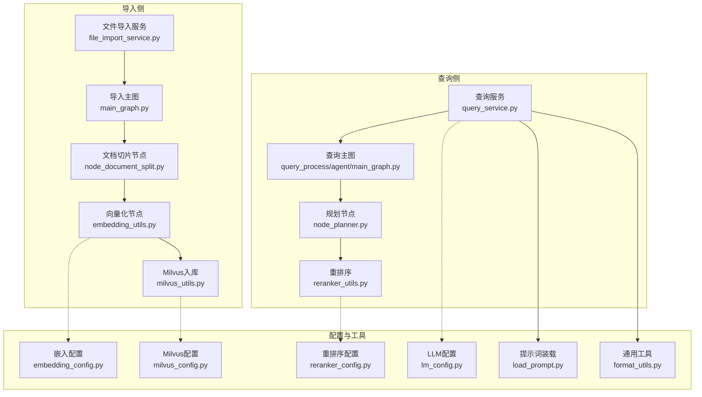
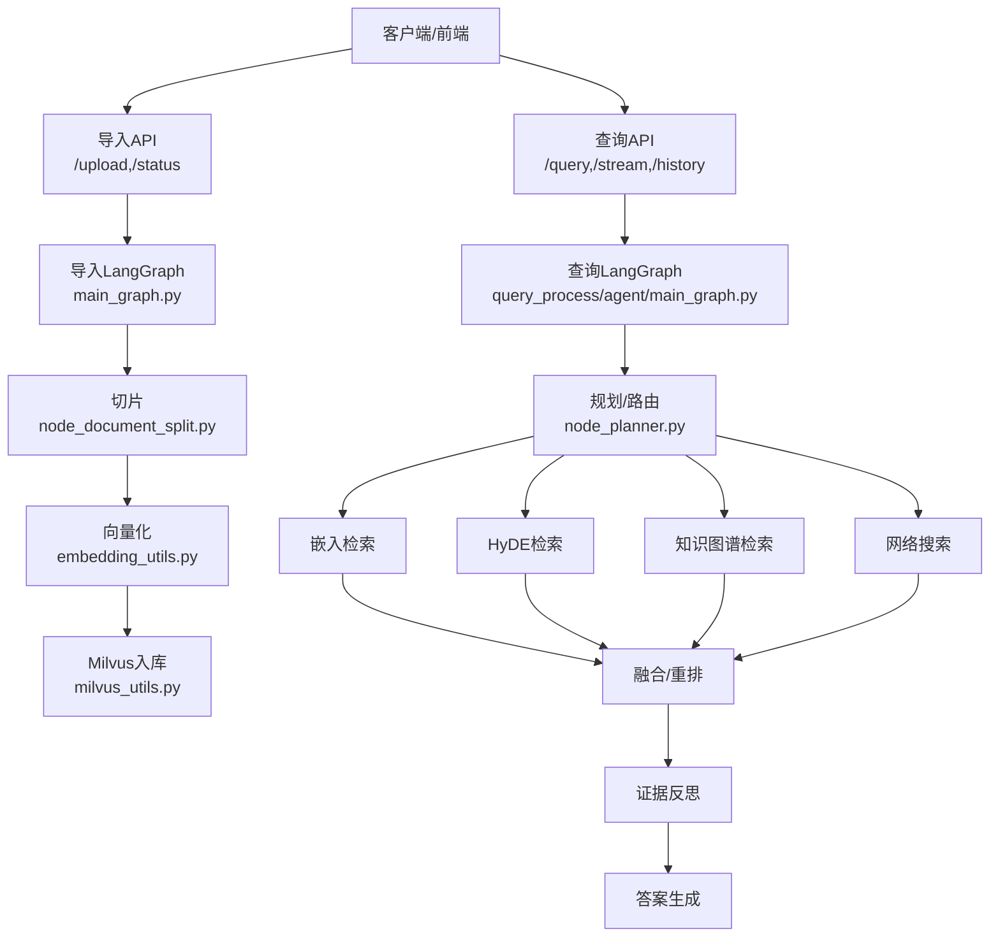
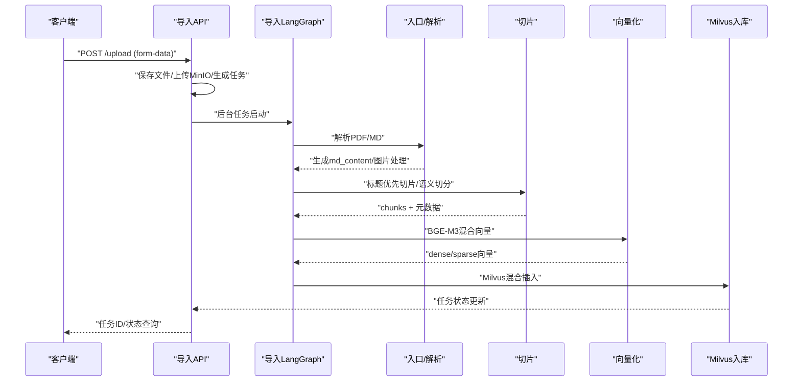
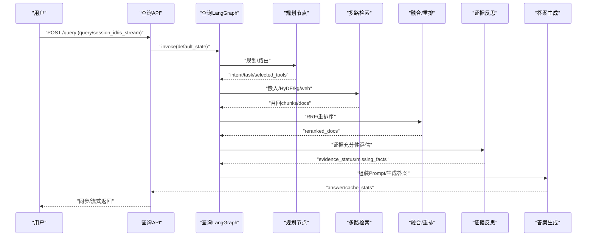
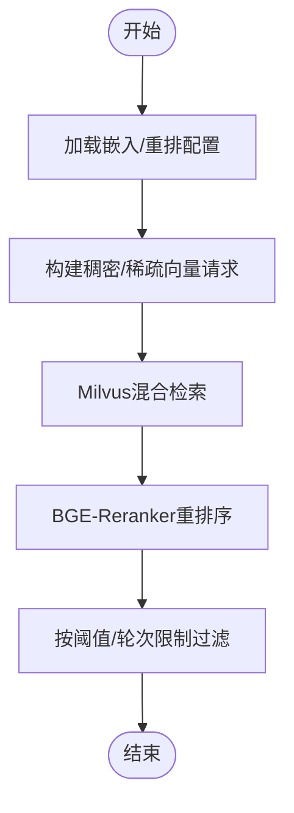
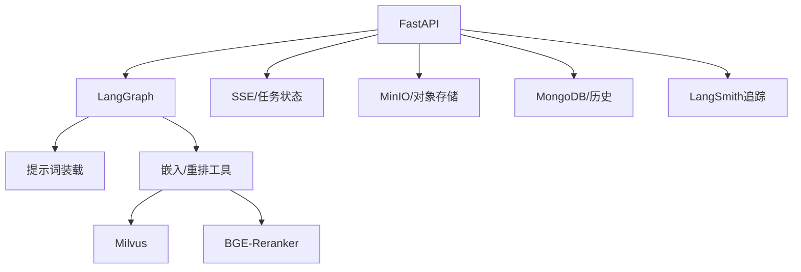

# 项目概述

<cite>
**本文档引用的文件**
- [pyproject.toml](file://pyproject.toml)
- [main_graph.py](file://app/import_process/agent/main_graph.py)
- [state.py](file://app/query_process/agent/state.py)
- [embedding_utils.py](file://app/lm/embedding_utils.py)
- [milvus_utils.py](file://app/clients/milvus_utils.py)
- [file_import_service.py](file://app/import_process/api/file_import_service.py)
- [query_service.py](file://app/query_process/api/query_service.py)
- [embedding_config.py](file://app/config/embedding_config.py)
- [reranker_utils.py](file://app/lm/reranker_utils.py)
- [reranker_config.py](file://app/config/reranker_config.py)
- [milvus_config.py](file://app/config/milvus_config.py)
- [lm_config.py](file://app/config/lm_config.py)
- [node_document_split.py](file://app/import_process/agent/nodes/node_document_split.py)
- [node_planner.py](file://app/query_process/agent/nodes/node_planner.py)
- [load_prompt.py](file://app/core/load_prompt.py)
- [format_utils.py](file://app/utils/format_utils.py)
- [RAG面试题整理.md](file://md/RAG面试题整理.md)
</cite>

## 目录
1. [简介](#简介)
2. [项目结构](#项目结构)
3. [核心组件](#核心组件)
4. [架构总览](#架构总览)
5. [详细组件分析](#详细组件分析)
6. [依赖关系分析](#依赖关系分析)
7. [性能考量](#性能考量)
8. [故障排查指南](#故障排查指南)
9. [结论](#结论)
10. [附录](#附录)

## 简介
zhiku智能知识库系统旨在通过LangGraph工作流引擎实现“智能文档导入 + 智能查询”的一体化RAG（检索增强生成）平台。系统围绕“文档切片稳定化、混合向量检索、多路检索与融合、证据反思与生成”构建端到端链路，支持PDF/MD文档的增量导入与流式问答，具备良好的可扩展性与工程化落地能力。

- 核心目标
  - 通过LangGraph将复杂的导入与查询流程模块化、可观测、可调试。
  - 以“chunk”为最小检索单元，结合稠密/稀疏混合向量与重排序，提升检索精度与鲁棒性。
  - 以TypedDict状态机贯穿查询全链路，实现意图识别、路由决策、证据反思与答案生成的闭环。

- 主要功能特性
  - 文档导入：PDF/MD解析、Markdown图片处理、稳定切片、增量diff、混合向量生成、Milvus入库。
  - 查询处理：意图识别与任务路由、多路检索（嵌入/HyDE/知识图谱/网络）、RRF融合、重排序、证据反思、答案生成与流式输出。
  - 工程能力：任务状态管理、SSE流式推送、提示词装载、缓存与追踪、配置驱动与单例模型加载。

- 技术定位
  - zhiku定位为面向“说明书/手册/设备文档”的RAG系统，强调“结构化切片 + 混合检索 + 证据反思”的工程化实践，兼顾召回精度与生成可控性。

- 应用场景
  - 设备/产品知识问答、操作指导、参数查询、故障排查、对比分析等。

## 项目结构
项目采用“按领域分层 + 按流程分图”的组织方式：
- app/import_process：导入流程（LangGraph工作流 + API入口）
- app/query_process：查询流程（LangGraph工作流 + API入口）
- app/lm：语言模型与嵌入/重排序工具
- app/clients：外部系统客户端（Milvus、MinIO、Mongo等）
- app/config：配置中心（模型/向量库/重排序等）
- app/utils：通用工具（SSE、任务状态、格式化、速率限制等）
- prompts：提示词模板
- md/static_flowcharts：流程图与文档

图表来源
- [file_import_service.py:1-432](file://app/import_process/api/file_import_service.py#L1-L432)
- [main_graph.py:1-88](file://app/import_process/agent/main_graph.py#L1-L88)
- [node_document_split.py:1-646](file://app/import_process/agent/nodes/node_document_split.py#L1-L646)
- [embedding_utils.py:1-117](file://app/lm/embedding_utils.py#L1-L117)
- [milvus_utils.py:1-204](file://app/clients/milvus_utils.py#L1-L204)
- [query_service.py:1-317](file://app/query_process/api/query_service.py#L1-L317)
- [embedding_config.py:1-31](file://app/config/embedding_config.py#L1-L31)
- [milvus_config.py:1-33](file://app/config/milvus_config.py#L1-L33)
- [reranker_config.py:1-28](file://app/config/reranker_config.py#L1-L28)
- [lm_config.py:1-33](file://app/config/lm_config.py#L1-L33)
- [load_prompt.py:1-49](file://app/core/load_prompt.py#L1-L49)
- [format_utils.py:1-63](file://app/utils/format_utils.py#L1-L63)

章节来源
- [pyproject.toml:1-33](file://pyproject.toml#L1-L33)
- [file_import_service.py:1-432](file://app/import_process/api/file_import_service.py#L1-L432)
- [query_service.py:1-317](file://app/query_process/api/query_service.py#L1-L317)

## 核心组件
- LangGraph工作流
  - 导入主图：以“入口 -> PDF/MD解析 -> Markdown图片处理 -> 切片 -> 商品名识别 -> diff -> 向量化 -> Milvus入库”为主线，支持跳过未变更文档与仅删除入库分支。
  - 查询主图：以“规划 -> 多路检索 -> 融合/重排 -> 证据反思 -> 生成”为主线，支持HyDE、嵌入检索、知识图谱与网络搜索的路由与融合。

- 状态机
  - 查询状态机（QueryGraphState）以TypedDict定义，贯穿输入层、规划层、检索层、治理与输出层，支持渐进填充与节点间共享。

- 模型与向量
  - BGE-M3混合向量（稠密+稀疏），Milvus混合检索（COSINE+IP），BGE-Reranker重排序，配置驱动与单例加载。

- API与服务
  - FastAPI服务：导入服务（8001）与查询服务（8002），支持任务状态查询、SSE流式输出、历史记录查询与清理。

章节来源
- [main_graph.py:1-88](file://app/import_process/agent/main_graph.py#L1-L88)
- [state.py:113-192](file://app/query_process/agent/state.py#L113-L192)
- [embedding_utils.py:1-117](file://app/lm/embedding_utils.py#L1-L117)
- [milvus_utils.py:117-204](file://app/clients/milvus_utils.py#L117-L204)
- [reranker_utils.py:158-224](file://app/lm/reranker_utils.py#L158-L224)
- [file_import_service.py:152-432](file://app/import_process/api/file_import_service.py#L152-L432)
- [query_service.py:150-317](file://app/query_process/api/query_service.py#L150-L317)

## 架构总览
系统采用“双服务 + LangGraph工作流 + 多路检索”的架构：
- 导入服务：接收文件 -> 解析/切片 -> 向量化 -> Milvus入库，支持任务状态与SSE回传。
- 查询服务：接收问题 -> 规划与路由 -> 多路检索 -> 融合/重排 -> 证据反思 -> 生成，支持同步/流式输出与历史管理。
- 数据与模型：Milvus向量库、BGE-M3混合向量、BGE-Reranker重排序、提示词模板与配置中心。

图表来源
- [file_import_service.py:256-432](file://app/import_process/api/file_import_service.py#L256-L432)
- [query_service.py:214-317](file://app/query_process/api/query_service.py#L214-L317)
- [main_graph.py:1-88](file://app/import_process/agent/main_graph.py#L1-L88)
- [state.py:113-192](file://app/query_process/agent/state.py#L113-L192)

## 详细组件分析

### 导入流程（LangGraph + API）
- 导入主图
  - 节点编排：入口 -> PDF/MD解析 -> Markdown图片处理 -> 切片 -> 商品名识别 -> diff -> 向量化 -> Milvus入库。
  - 路由策略：根据状态决定是否跳过、是否走PDF解析或Markdown图片处理；diff后根据是否有新增/修改或仅删除走不同分支。
- 文档切片
  - 标题优先切分，再按段落/列表/表格/代码块做语义切分，支持超长块二次切分与短块保守合并，保证chunk稳定性与增量diff友好。
- API入口
  - 支持多文件上传、MinIO对象存储、后台任务执行、任务状态查询与SSE回传。

图表来源
- [file_import_service.py:256-432](file://app/import_process/api/file_import_service.py#L256-L432)
- [main_graph.py:1-88](file://app/import_process/agent/main_graph.py#L1-L88)
- [node_document_split.py:38-76](file://app/import_process/agent/nodes/node_document_split.py#L38-L76)
- [embedding_utils.py:52-98](file://app/lm/embedding_utils.py#L52-L98)
- [milvus_utils.py:158-197](file://app/clients/milvus_utils.py#L158-L197)

章节来源
- [main_graph.py:34-85](file://app/import_process/agent/main_graph.py#L34-L85)
- [node_document_split.py:38-646](file://app/import_process/agent/nodes/node_document_split.py#L38-L646)
- [file_import_service.py:256-432](file://app/import_process/api/file_import_service.py#L256-L432)

### 查询流程（LangGraph + API）
- 查询状态机
  - TypedDict定义输入层（原始问题/历史/商品名）、规划层（意图/任务/路由）、检索层（多路召回/融合/重排）、治理与输出层（证据状态/引用/答案）。
- 规划节点
  - 读取改写问题、历史与商品名，先命中规划器缓存，未命中则调用LLM生成检索计划，写回状态并记录缓存命中。
- API入口
  - 支持同步/流式查询、SSE流式推送、会话历史查询与清理、健康检查。

图表来源
- [query_service.py:150-317](file://app/query_process/api/query_service.py#L150-L317)
- [state.py:113-192](file://app/query_process/agent/state.py#L113-L192)
- [node_planner.py:56-148](file://app/query_process/agent/nodes/node_planner.py#L56-L148)

章节来源
- [state.py:1-192](file://app/query_process/agent/state.py#L1-L192)
- [node_planner.py:56-148](file://app/query_process/agent/nodes/node_planner.py#L56-L148)
- [query_service.py:150-317](file://app/query_process/api/query_service.py#L150-L317)

### 检索与重排（混合向量 + 重排序）
- 混合向量与检索
  - BGE-M3原生L2归一化，支持稠密+稀疏向量，Milvus混合检索（COSINE+IP），支持按条件过滤与限流返回。
- 重排序
  - BGE-Reranker单例加载，支持本地路径优先与回退远程仓库，按query-doc pair计算相关性得分。

图表来源
- [embedding_utils.py:8-49](file://app/lm/embedding_utils.py#L8-L49)
- [milvus_utils.py:117-197](file://app/clients/milvus_utils.py#L117-L197)
- [reranker_utils.py:158-224](file://app/lm/reranker_utils.py#L158-L224)

章节来源
- [embedding_utils.py:52-98](file://app/lm/embedding_utils.py#L52-L98)
- [milvus_utils.py:158-197](file://app/clients/milvus_utils.py#L158-L197)
- [reranker_utils.py:158-224](file://app/lm/reranker_utils.py#L158-L224)

### 提示词与工程化工具
- 提示词装载
  - 从prompts目录按文件名加载模板，支持变量渲染，便于统一管理与调试。
- JSON格式化
  - 提供统一的JSON格式化工具，保障日志与调试输出一致性。

章节来源
- [load_prompt.py:5-28](file://app/core/load_prompt.py#L5-L28)
- [format_utils.py:11-54](file://app/utils/format_utils.py#L11-L54)

## 依赖关系分析
- 技术栈概览
  - Web框架：FastAPI + Uvicorn
  - 工作流：LangGraph
  - 向量库：Milvus + PyMilvus
  - 嵌入与重排：BAAI BGE-M3/BGE-Reranker
  - 模型服务：OpenAI LangChain集成
  - 对象存储：MinIO
  - 数据库：MongoDB（历史记录）
  - 可观测性：LangSmith中间件

图表来源
- [pyproject.toml:6-32](file://pyproject.toml#L6-L32)
- [file_import_service.py:34-54](file://app/import_process/api/file_import_service.py#L34-L54)
- [query_service.py:26-44](file://app/query_process/api/query_service.py#L26-L44)

章节来源
- [pyproject.toml:1-33](file://pyproject.toml#L1-L33)

## 性能考量
- 检索参数与稳定性
  - 文档切片长度与短块合并阈值平衡语义完整性与召回精度；混合检索与重排序在召回与排序两端协同，避免K值过大导致信噪比下降。
- 模型与硬件
  - 嵌入与重排序采用单例模式与设备/半精度配置，减少重复初始化与显存占用。
- 并发与流式
  - 查询服务支持同步/流式返回与SSE，结合后台任务与任务状态管理，提升用户体验与系统吞吐。

章节来源
- [RAG面试题整理.md:79-173](file://md/RAG面试题整理.md#L79-L173)
- [RAG面试题整理.md:291-335](file://md/RAG面试题整理.md#L291-L335)
- [embedding_utils.py:8-49](file://app/lm/embedding_utils.py#L8-L49)
- [reranker_utils.py:158-224](file://app/lm/reranker_utils.py#L158-L224)
- [query_service.py:214-277](file://app/query_process/api/query_service.py#L214-L277)

## 故障排查指南
- 常见问题定位
  - 导入失败：检查MinIO连接、文件类型与路径安全校验、LangGraph节点状态与任务结果。
  - 查询异常：检查提示词模板是否存在、LLM配置与LangSmith中间件、SSE队列与任务状态。
  - 向量/重排异常：检查模型路径与设备配置、单例初始化日志、Milvus连接与集合配置。
- 日志与追踪
  - 统一日志记录与LangSmith追踪元数据，便于端到端回溯。

章节来源
- [file_import_service.py:356-372](file://app/import_process/api/file_import_service.py#L356-L372)
- [query_service.py:205-211](file://app/query_process/api/query_service.py#L205-L211)
- [embedding_config.py:18-24](file://app/config/embedding_config.py#L18-L24)
- [reranker_config.py:16-21](file://app/config/reranker_config.py#L16-L21)
- [milvus_config.py:21-26](file://app/config/milvus_config.py#L21-L26)

## 结论
zhiku通过LangGraph将复杂的RAG流程模块化与可观测化，结合“结构化切片 + 混合向量 + 多路检索 + 证据反思”的工程化实践，实现了对说明书/手册类文档的稳定检索与可控生成。系统在导入与查询两侧均提供清晰的API与状态管理，具备良好的扩展性与运维体验，适合在企业知识库、客服问答、运维支持等场景落地。

## 附录
- 关键特性清单
  - LangGraph工作流编排、导入/查询双服务、SSE流式输出、任务状态管理、提示词模板、缓存与追踪、配置驱动、单例模型加载、混合向量与重排序、多路检索与融合。
- 发展历程（基于代码演进线索）
  - 导入流程从“切分 -> 识别 -> 向量化 -> 全量入库”演进为“切分 -> 识别 -> diff -> 只对变化部分向量化/入库”，提升增量导入效率。
  - 查询流程强化规划与证据反思，支持多轮检索与缓存链路优化。
- RAG最佳实践要点（来自项目文档）
  - 切片长度与短块合并阈值的工程折中；混合检索与重排序的协同；证据反思与答案生成的边界约束；HyDE对模糊提问的增强；动态K与证据充分性评估。

章节来源
- [main_graph.py:17-20](file://app/import_process/agent/main_graph.py#L17-L20)
- [RAG面试题整理.md:175-205](file://md/RAG面试题整理.md#L175-L205)
- [RAG面试题整理.md:534-582](file://md/RAG面试题整理.md#L534-L582)
- [RAG面试题整理.md:457-497](file://md/RAG面试题整理.md#L457-L497)